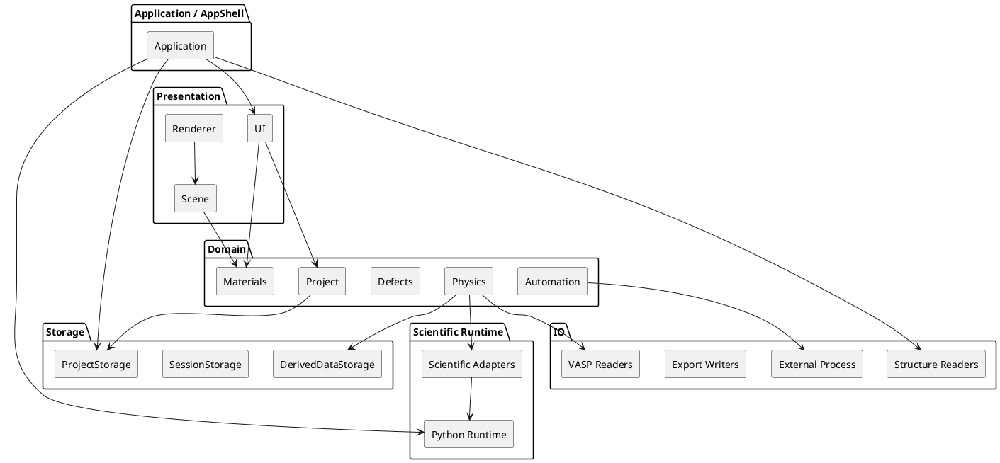

# ADR-001 – Modular Domain Monolith as the Primary Architecture

- **Status:** Accepted
- **Date:** 2026-04-03
- **Decision Makers:** Project author
- **Related Documents:** `SPEC-1-DefectsStudio-MVP.md`, `DefectsStudio-Project-Overview.md`

## Context

DefectsStudio is a desktop scientific workbench for the analysis of point defects in insulators and semiconductors, with a particular focus on materials relevant to quantum photonics. The application is intended to unify structure editing, visualization, VASP-oriented workflows, volumetric workflows, defect thermodynamics, optics/phonons, and later additional scientific and infrastructure modules in one coherent environment.

The project is developed as a **single-user-first, solo-maintained codebase with AI assistance**. This creates a specific architectural pressure profile:

- the codebase must remain understandable after long pauses,
- boundaries must stay explicit,
- the system must tolerate gradual growth without large rewrites,
- scientific logic must not dissolve into UI or rendering code,
- external integrations must remain controllable,
- architecture must not introduce unnecessary operational or conceptual overhead.

The project is also a **desktop application**, not a distributed backend system. Its dominant complexity comes from domain modeling, scientific workflows, file formats, rendering, and integration with scientific tooling — not from deployment topology.

## Decision

DefectsStudio will be built as a **modular domain monolith** packaged primarily as a **single desktop executable**.

The architecture is organized around a **domain-centered core** with a **single composition root** in `Application` and a small number of top-level areas:

- **Presentation**
- **Domain**
- **Storage**
- **IO**
- **Scientific Runtime**

This is the primary architecture for the project.

## Meaning of the decision

“Modular domain monolith” means:

- one main process,
- one main executable,
- one coherent codebase,
- strong internal module boundaries,
- explicit dependency rules,
- no microservice-style distribution,
- no plugin-first architecture as the primary organizing model,
- no ECS-driven scientific source of truth,
- no “everything is a service” architecture.

The word **monolith** here is about deployment and runtime shape.  
The word **modular** is about code organization, responsibilities, boundaries, and long-term maintainability.

## Why this architecture was chosen

This architecture fits the project better than the alternatives because it balances **clarity**, **technical control**, and **future growth** without paying the cost of unnecessary abstraction.

### Main reasons

1. **The project is desktop-first**

   DefectsStudio is a local scientific workbench. The hard problems are domain modeling, visualization, scientific workflows, persistence, and interoperability with scientific libraries and file formats. Distributed-system complexity would not solve the dominant problems here.

2. **The domain is tightly coupled**

   Structures, defects, thermodynamics, optics, phonons, VASP data, volumetrics, and project persistence are distinct concerns, but they are still strongly related through shared scientific concepts and shared workflow state. Keeping them inside one coherent system reduces integration friction.

3. **Solo development favors explicit modularity over distributed architecture**

   A solo-maintained project benefits more from clear module boundaries, ADRs, testable contracts, and predictable code organization than from deployment fragmentation.

4. **The codebase must stay incrementally extensible**

   The architecture must allow the project to grow from early foundations through Scientific MVP 1.0 and later into symmetry, diffusion, remote workflows, database integration, and advanced visualization without forcing a full redesign.

5. **The application must remain debuggable**

   A monolithic runtime is easier to reason about during debugging of complex scientific/editor workflows than a more distributed or plugin-heavy runtime model.

## Architecture shape

At a high level, the project is organized like this:

## Core architectural consequences

### 1. `Application` is the AppShell and composition root

`Application` is responsible for:

- process startup and shutdown,
- bootstrap of windowing, rendering, diagnostics, and runtime services,
- creation and wiring of adapters and facades,
- ownership of the high-level lifecycle.

`Application` is **not** where scientific domain logic belongs.

### 2. The domain model is the source of truth

The domain owns the meaning of:

- project state,
- structures,
- defects,
- analysis state,
- scientific results.

No other subsystem is allowed to become the authoritative scientific model.

### 3. ECS is limited to scene/editor/visualization

ECS may represent:

- visual atoms and bonds,
- labels and annotations,
- selection overlays,
- gizmos and scene/editor state.

ECS must not become the scientific source of truth for project data, structures, defects, or analysis results.

### 4. Storage is separated from IO

Storage and IO are distinct top-level areas:

- **Storage** handles persistence, autosave, session continuity, derived-data management, and project-oriented saved state.
- **IO** handles parsers, filesystem operations, exports, external process integration, and later network/remote integrations.

This separation avoids mixing persistence concerns with raw integration mechanics.

### 5. Python is treated as Scientific Runtime

In Scientific MVP 1.0, Python is an infrastructure-backed scientific runtime, not a first-class end-user interaction channel.

This means:

- Python is used behind controlled boundaries,
- C++ owns the application flow,
- Python libraries provide scientific capabilities,
- user-facing scripting is not treated as a primary architectural pillar in MVP.

### 6. Derived data is managed explicitly

Heavy outputs such as volumetric intermediates, meshes, previews, and similar generated data must remain separate from the lightweight core project state. This protects project clarity and keeps storage strategy flexible.

## Rejected alternatives

### Alternative A — Pure layered monolith as the primary architecture
Rejected because it is too vague for the needs of this project. It tends to blur domain boundaries unless reinforced by explicit modular rules, and it does not sufficiently emphasize domain ownership, storage/IO separation, and scene-vs-domain separation.

### Alternative B — Microservices or distributed architecture
Rejected because the project is a desktop scientific workbench and would not benefit from the operational and conceptual cost of service decomposition.

### Alternative C — Plugin-first architecture
Rejected as the primary organizing model because the project still needs a coherent core model before optional extension mechanisms become useful.

### Alternative D — ECS as the main scientific model
Rejected because ECS is a good fit for scene/editor representation but a poor fit for the authoritative scientific model of projects, structures, defects, and analysis results.

### Alternative E — Python-first application model
Rejected for MVP because it would weaken C++ control over the runtime, increase maintenance complexity, and blur the distinction between scientific integration and user-facing scripting.

## Benefits

Expected benefits of this decision:

- easier reasoning about the system as a whole,
- lower operational complexity,
- stronger domain coherence,
- explicit code boundaries,
- easier onboarding after long pauses,
- better fit for solo development,
- simpler debugging across editor + scientific workflows,
- easier incremental expansion toward post-MVP capabilities.

## Risks

Main risks of this decision:

- the monolith could degrade into a “big ball of mud” if boundaries are not actively enforced,
- internal modules may start bypassing intended contracts,
- Presentation could begin calling infrastructure directly,
- ECS could slowly become the accidental source of truth,
- Python-backed integrations could leak implementation details into the domain.

## Risk mitigations

To keep the modular monolith healthy:

- maintain clear folder and namespace boundaries,
- use ADRs for major architectural choices,
- enforce dependency rules in code review,
- keep domain logic out of UI and renderer code,
- keep scientific meaning in domain models, not scene state,
- keep tests around parsers, serialization, and scientific-runtime boundaries,
- formalize recurring patterns only when needed, not preemptively.

## Implementation notes

This decision does **not** require every architectural mechanism to be formalized immediately.

The implementation strategy remains:

- TODO-first,
- abstractions when needed,
- one main executable by default,
- selective extraction of technical libraries only where isolation is clearly justified.

Examples of later technical extraction candidates include:

- GPU FNV correction engine,
- WAVECAR → KS orbital projection / CHGCAR-oriented engine.

These are compatible with the modular monolith approach because they remain technical subcomponents, not a replacement for the main architecture.

## Acceptance criteria

This ADR should be considered successfully applied when:

- the codebase is still structured around the agreed top-level areas,
- `Application` remains the composition root,
- domain state remains authoritative,
- Presentation does not own scientific truth,
- Storage and IO remain distinct,
- Python remains behind controlled runtime boundaries,
- future modules continue to fit the same architectural frame without requiring a full structural reset.

## Follow-up ADRs

The following decisions should be tracked in separate ADRs:

- domain as source of truth and ECS boundary,
- Python as Scientific Runtime,
- Storage vs IO split,
- single executable with selective technical libraries,
- TODO-first / abstractions-when-needed delivery model.
