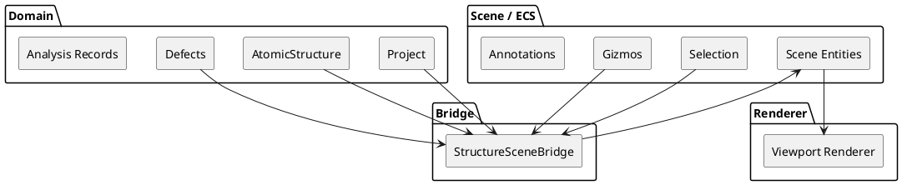

# ADR-002 – Domain as the Source of Truth and ECS Boundary

- **Status:** Accepted
- **Date:** 2026-04-03
- **Decision Makers:** Project author
- **Related Documents:** `SPEC-1-DefectsStudio-MVP.md`, `ADR-001-modular-domain-monolith.md`

## Context

DefectsStudio combines several concerns that naturally pull state in different directions:

- scientific/project state,
- editor interaction state,
- scene representation,
- rendering data,
- analysis results,
- temporary interaction overlays.

Because the application includes a rich viewport, scene editing, atom selection, gizmos, labels, annotations, and future visualization-heavy modules, it is natural to use ECS for editor-side and visualization-side concerns. At the same time, the project also needs a durable and scientifically meaningful model of structures, defects, project state, and analysis results.

Without an explicit rule, there is a serious risk that scene data and ECS entities gradually become the accidental source of truth, especially as editing features become more powerful.

## Decision

The **domain model** is the authoritative source of truth for:

- project state,
- structures,
- defects,
- scientific parameters,
- analysis records,
- scientific results.

**ECS is limited to scene/editor/visualization concerns** and must remain a derived representation.

This is a strict architectural rule.

## Meaning of the decision

This decision means that the following questions must always resolve in favor of the domain:

- What is the real project state?
- What is the real structure?
- What atoms, bonds, labels, tags, or defect-related entities exist in scientific terms?
- What analysis result is authoritative?
- What data must be persisted and reopened?

ECS may represent these things visually or interactively, but ECS does not define their scientific meaning.

In practical terms:

- domain objects are persisted,
- scene objects are reconstructed or synchronized,
- rendering consumes scene/editor data,
- scientific logic consumes domain data,
- project persistence follows domain-owned state, not renderer-owned state.

## Why this decision was made

### 1. Scientific integrity must not depend on editor state

A scientific workbench cannot allow scientific meaning to drift into transient viewport constructs. Scene entities are suitable for interaction and visualization, but they are not a reliable model for persistent scientific data.

### 2. ECS is a great fit for editor interaction, but not for authoritative scientific modeling

ECS works well for:

- visual atoms and bonds,
- labels,
- selection markers,
- helper overlays,
- viewport tools,
- manipulation handles,
- future visual annotation systems.

But scientific concepts such as project persistence, structure identity, defect configurations, charge states, scientific results, and reusable workflow state are more naturally expressed as domain models.

### 3. Persistence must be predictable

Project save/load and reproducibility depend on stable domain-owned structures. If ECS becomes authoritative, persistence becomes entangled with scene concerns, rendering concerns, and temporary interaction state.

### 4. Domain-level validation is easier to reason about

Validation of structures, defects, analysis inputs, and reproducible results belongs in domain-facing models and services. It is much easier to keep scientific rules explicit there than inside scene systems.

## What belongs to the domain

The domain should own things such as: `Project`, `WorkspaceItem`, `AtomicStructure`, `Lattice`, `Atom`, `Species`, `Defect`, `DefectConfiguration`, `ChargeState`, `AnalysisRecord`, `analysis parameters`, `persisted scientific outputs`, `references to derived outputs`

The domain also owns scientific meaning such as: `lattice definitions`,`structure identity`,`defect identity`,`charge-state meaning`,`project references`,`scientific result semantics`.

## What belongs to ECS / scene

ECS or scene/editor state may own things such as: `renderable atom entities`, `renderable bond entities`, `labels and captions`, `selection state`, `visibility toggles`, `gizmo helpers`, `viewport-only transforms`, `helper markers`, `temporary preview objects`, `annotation overlays`, `pickable scene handles`.

These are editor and visualization concerns, not the scientific source of truth.

## Domain ↔ scene synchronization

A dedicated bridge should synchronize between the authoritative domain model and the derived scene representation.

Recommended name:
- `StructureSceneBridge`

Responsibilities of the bridge:

- build scene entities from `AtomicStructure`,
- update scene after domain changes,
- map selected entities back to domain objects,
- commit allowed editing operations from scene tools back into domain data,
- coordinate labels and annotations that depend on domain objects.

This bridge exists specifically to prevent the domain and scene from drifting apart.

## High-level model

## Allowed interaction model

Correct direction:

- domain changes update the scene,
- scene tools act through the bridge,
- renderer consumes scene/editor state,
- persistence saves domain-owned state.

Typical sequence:

1. A structure is imported into the domain model.
2. The bridge creates scene entities for atoms, bonds, and labels.
3. The renderer draws the scene.
4. The user selects atoms in the viewport.
5. Scene selection is mapped back to domain object identities.
6. An edit command updates the domain model.
7. The bridge refreshes the scene representation.

## Forbidden patterns

The following patterns are explicitly forbidden:

- treating ECS entities as the authoritative persistent structure model,
- saving the project by serializing raw scene state as scientific truth,
- putting scientific defect logic inside scene systems,
- allowing renderer-owned objects to define persistent project data,
- bypassing the bridge when scene tools need to modify domain state.

## Benefits

Expected benefits:

- scientific state remains stable and explicit,
- persistence remains predictable,
- scene code stays focused on interaction and visualization,
- renderer code stays free of scientific ownership,
- later scientific modules can grow without being coupled to viewport internals,
- debugging becomes easier because model ownership is unambiguous.

## Risks

Main risks:

- duplicate representations may drift,
- bridge code may become under-specified or fragile,
- developers may be tempted to “just read from ECS” for convenience,
- shortcuts may appear when implementing editor features quickly.

## Mitigations

To reduce those risks:

- keep identity mapping explicit between domain objects and scene entities,
- keep the bridge small and focused,
- document which edits are allowed from scene tools,
- add tests around structure import → scene build → edit → sync workflows,
- review PRs for scene-to-domain bypasses,
- keep persistence rooted in domain state.

## Implementation notes

This ADR does not require a perfect bridge abstraction from day one, but it does require the ownership rule to be respected from the beginning.

A minimal initial implementation is acceptable as long as:

- imported structures enter the domain first,
- scene entities are derived from domain state,
- edits that affect scientific state are committed back into the domain,
- save/load flows continue to treat domain state as authoritative.

## Acceptance criteria

This ADR should be considered successfully applied when:

- project save/load uses domain-owned data as the authoritative source,
- ECS can be rebuilt or synchronized from the domain model,
- scene/editor tools do not bypass the domain for persistent scientific edits,
- renderer and scene code do not silently become the persistence model,
- scientific modules consume domain data rather than scene-owned state.

## Follow-up ADRs

Related follow-up decisions include:

- Python as Scientific Runtime,
- Storage vs IO split,
- one executable with selective technical library extraction,
- derived data handling strategy.
