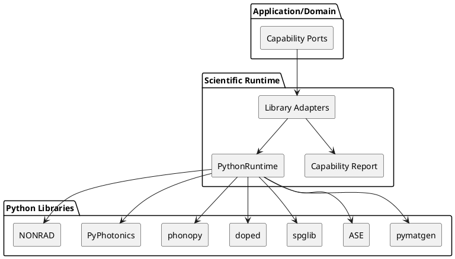

# ADR-003 – Python as Scientific Runtime

- **Status:** Accepted
- **Date:** 2026-04-05
- **Decision Makers:** Project author
- **Related Documents:** `SPEC-1-DefectsStudio-MVP-v2.md`, `ADR-001-modular-domain-monolith.md`, `ADR-002-domain-as-source-of-truth-and-ecs-boundary.md`

## Context

DefectsStudio depends on a number of mature scientific Python libraries that provide capabilities which would be expensive, slow, or unnecessary to reimplement directly in C++. These libraries are essential, but they must not become the architectural center of the application.

The application is still a C++ desktop workbench with its own lifecycle, UI, renderer, project model, persistence rules, and diagnostics. Python is needed, but must remain controlled.

## Decision

In Scientific MVP 1.0, Python is treated as a **Scientific Runtime** behind controlled boundaries.

This means:

- C++ owns the application lifecycle and user-facing flow
- Python is an infrastructure-backed scientific execution environment
- Python is **not** a first-class user scripting model in MVP
- the public application-facing contracts are **capability-based**
- the internal implementations are **library-based adapters**
- Python-native objects never cross into domain or presentation boundaries

## Meaning of the decision

### Capability-based public ports

The rest of the application talks in terms of what DefectsStudio wants to do:

- `IStructureImportPort`
- `ISymmetryAnalysisPort`
- `IVaspPostprocessPort`
- `IDefectThermodynamicsPort`
- `IPhononAnalysisPort`
- `IOpticalAnalysisPort`

The rest of the application does **not** talk directly in terms of:

- `IPymatgenPort`
- `IDopedPort`
- `IPhonopyPort`

### Library-based internal adapters

Inside Scientific Runtime, capabilities are implemented through adapters such as:

- `PymatgenAdapter`
- `ASEAdapter`
- `SpglibAdapter`
- `DopedAdapter`
- `PhonopyAdapter`
- `PyPhotonicsAdapter`
- `NonRadAdapter`

These adapters are allowed to know the details of specific libraries. The rest of the system is not.

## Why this decision was made

1. The application must remain C++-owned.
2. Scientific leverage from Python libraries is extremely high.
3. Capability-based contracts are more stable than library-based contracts.
4. A public scripting surface would multiply maintenance cost too early.
5. Controlled adapters make testing, error handling, and future replacement easier.

## Architectural consequences

- Python execution is mediated through a dedicated Scientific Runtime area
- all results returned to the rest of the application are C++ DTOs or normalized result objects
- GIL handling is a runtime concern
- Python exceptions must become structured application errors
- renderer code must not depend on Python execution
- runtime capability and version reporting are part of the Scientific Runtime contract

## High-level model

## Testing and compatibility policy

Scientific Runtime must include three layers of validation:

### 1. Capability smoke tests
Used to confirm that:

- a required library is installed
- the version is supported or at least recognized
- a minimal call can be executed

### 2. Adapter contract tests
Used to confirm that:

- capability-based ports still return the expected DTOs
- data-shape and error-shape expectations remain stable
- C++-facing contracts did not silently change

### 3. Golden/reference tests
Used to confirm that:

- representative scientific workflows still return expected results
- dependency upgrades did not silently shift behavior in unacceptable ways

## Planned future boundary

Scientific Runtime is treated as a **planned future technical library boundary**.

This means:

- it remains part of the main codebase today
- it does not have to be a separate build artifact yet
- but it should be structured as though later extraction is plausible

## Rejected alternatives

- Python as a first-class MVP user scripting architecture
- Python calls embedded ad hoc throughout the application
- full reimplementation of scientific functionality in C++ from the start
- library-first public ports as the main application-facing abstraction

## Acceptance criteria

This ADR should be considered successfully applied when:

- the rest of the application depends on capability-based ports
- specific library details remain isolated in adapters
- Python-native objects do not leak into domain or UI
- capability/version diagnostics exist
- smoke, contract, and golden tests exist for representative functionality
