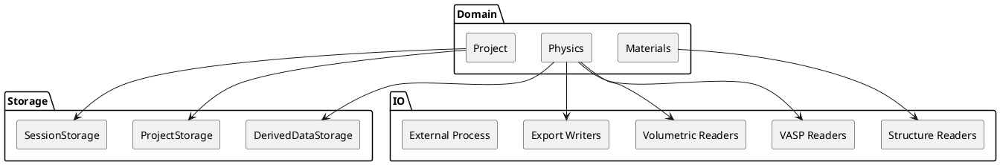

# ADR-004 – Storage vs IO Split

- **Status:** Accepted
- **Date:** 2026-04-03
- **Decision Makers:** Project author
- **Related Documents:** `SPEC-1-DefectsStudio-MVP.md`, `ADR-001-modular-domain-monolith.md`, `ADR-003-python-as-scientific-runtime.md`

## Context

DefectsStudio works with several different categories of data-handling responsibilities:

- project persistence,
- autosave and session continuity,
- lightweight analysis state,
- heavy derived outputs,
- raw file parsing,
- filesystem operations,
- export writing,
- external process execution,
- future remote or network integrations.

In many projects these responsibilities are loosely grouped under a generic “infrastructure” label. In practice, however, persistence and lifecycle-oriented project state management are different from raw integration mechanics such as parsers, filesystem adapters, and export writers.

If these areas are not separated early, the codebase risks collapsing into a mixed layer where persistence, parsing, caching, exports, and process execution all live side by side without clear ownership.

## Decision

DefectsStudio will separate **Storage** from **IO** as two distinct top-level architectural areas.

- **Storage** is responsible for persistence and managed application state.
- **IO** is responsible for raw integration with files, formats, exports, processes, and later remote/network boundaries.

This split is part of the core architecture.

## Meaning of the decision

### Storage

Storage owns concerns such as:

- project save/load,
- autosave,
- session continuity,
- persisted analysis state,
- references to imported data,
- management of derived outputs,
- manifests and indexes for project-owned or project-related data.

Typical storage-side components include:

- `ProjectStorage`
- `SessionStorage`
- `DerivedDataStorage`
- optional `AnalysisRecordStorage` if later justified

### IO

IO owns concerns such as:

- structure readers and writers,
- volumetric readers,
- VASP file readers,
- raw filesystem services,
- export writers,
- file dialogs,
- external process runners,
- future network/remote integrations.

Typical IO-side components include:

- `Structure Readers`
- `VASP Readers`
- `Volumetric Readers`
- `Export Writers`
- `External Process`
- future SSH/SFTP or API adapters

## Why this decision was made

### 1. Persistence and parsing are different responsibilities

Saving and reopening a scientific project is not the same concern as parsing POSCAR, OUTCAR, CHGCAR, or writing an export file. One manages application-owned continuity, the other handles external representations.

### 2. Project state requires stronger lifecycle guarantees

Storage is tied to autosave, reopening, session continuity, derived-data tracking, and reproducible project state. These responsibilities require a more deliberate ownership model than raw parser code.

### 3. IO will grow in many directions

IO will eventually include multiple file formats, export formats, process integrations, and remote/network tooling. Keeping it separate prevents those expansions from muddying persistence code.

### 4. Derived data needs explicit ownership

Heavy outputs such as volumetric intermediates, meshes, previews, and related generated files should be managed by the application, but not mixed directly into the lightweight core project state. This fits naturally into Storage, not raw IO.

## High-level model

## How to think about the boundary

A useful mental rule is:

- if the responsibility is about **what the application persists and manages over time**, it belongs to **Storage**;
- if the responsibility is about **talking to the outside world through files, formats, exports, or external tools**, it belongs to **IO**.

That means, for example:

- `project.yaml` lifecycle → Storage
- reading POSCAR → IO
- writing a CSV export → IO
- deciding which derived mesh file belongs to a project and how it is tracked → Storage
- opening a file path and reading bytes → IO

## Derived data handling

Derived outputs should be handled explicitly.

Examples include:

- cached volumetric transformations,
- isosurface meshes,
- preview images,
- preprocessed intermediate data,
- future GPU-produced outputs.

These outputs should not be forced directly into the core lightweight project state. Instead:

- the project should keep references, manifests, or ownership metadata,
- Storage should manage how those outputs are tracked,
- IO should still handle the low-level reading/writing mechanics when files must actually be read or written.

This means derived-data ownership belongs to Storage, while file-format mechanics still belong to IO.

## Allowed collaboration model

Correct usage pattern:

1. The domain decides that some project state or derived output must be persisted or tracked.
2. Storage decides how that state is represented, linked, indexed, or versioned.
3. IO performs raw reads/writes/parsing/export mechanics when needed.
4. The domain consumes the resulting data through controlled boundaries.

## Forbidden patterns

The following patterns are explicitly discouraged:

- parser code directly becoming the owner of project persistence,
- mixing autosave logic into raw reader/writer classes,
- treating raw filesystem services as the project model,
- letting export writers define scientific project state,
- placing derived-data ownership only inside parser or renderer code,
- bypassing storage rules whenever persistence becomes inconvenient.

## Benefits

Expected benefits:

- clearer ownership of persistence concerns,
- cleaner growth path for file format and export support,
- better separation between project continuity and external integration,
- easier reasoning about derived-data management,
- reduced risk of infrastructure becoming one undifferentiated layer.

## Risks

Main risks:

- boundary confusion in early implementation,
- duplicated concepts between storage metadata and raw file services,
- temptation to “just write a file directly” from arbitrary modules,
- over-engineering storage abstractions before they are needed.

## Mitigations

To reduce those risks:

- document the rule in architecture docs and ADRs,
- keep initial storage implementations simple,
- add tests for save/load and derived-data ownership,
- review new parser/export code for persistence leakage,
- introduce broader storage abstractions only when recurring complexity justifies them.

## Implementation notes

This ADR does **not** require a fully elaborate storage platform from the first day.

A minimal acceptable implementation still counts as compliant if:

- project save/load is clearly separated from raw format parsing,
- session continuity is treated as a storage concern,
- derived outputs are not silently mixed into lightweight project state,
- raw readers and writers remain IO concerns.

This aligns with the broader implementation strategy of TODO-first delivery with abstractions introduced when needed.

## Rejected alternatives

### Alternative A — Single undifferentiated infrastructure layer
Rejected because it encourages persistence, parsing, exports, caching, and process execution to collapse into a single mixed responsibility area.

### Alternative B — Put all file-related logic into IO
Rejected because project persistence and derived-data ownership are application-state concerns, not just file mechanics.

### Alternative C — Put all integration logic into Storage
Rejected because parsers, exports, and external-process integration are not persistence semantics and should not be hidden inside storage components.

## Acceptance criteria

This ADR should be considered successfully applied when:

- project persistence code is visibly distinct from parser/export/process code,
- session continuity remains a storage concern,
- derived outputs are tracked through managed application-side ownership,
- readers and writers remain IO tools rather than persistence owners,
- future remote/network integrations can fit naturally into IO without distorting storage responsibilities.

## Follow-up ADRs

Closely related follow-up decisions include:

- selective technical library extraction,
- derived-data lifecycle formalization,
- remote-work architecture,
- future database integration.
