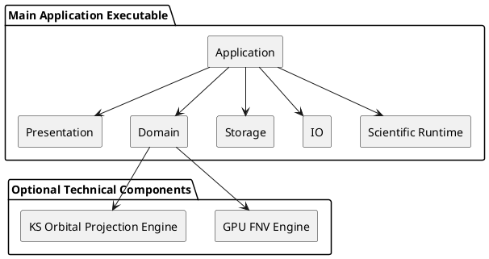

# ADR-005 – Single Executable with Selective Technical Libraries

- **Status:** Accepted
- **Date:** 2026-04-03
- **Decision Makers:** Project author
- **Related Documents:** `SPEC-1-DefectsStudio-MVP.md`, `ADR-001-modular-domain-monolith.md`, `ADR-004-storage-vs-io-split.md`

## Context

DefectsStudio is a growing desktop scientific workbench with many technically distinct concerns:

- UI and editor workflows,
- rendering and scene handling,
- structure and defect modeling,
- VASP-related parsing and analysis,
- volumetric workflows,
- scientific Python integrations,
- future GPU-heavy compute components,
- possible future remote and database capabilities.

A project with this scope can easily drift toward either of two unhealthy extremes:

1. **Too little structure**  
   Everything stays in one giant build target with weak boundaries, and the codebase becomes difficult to navigate and maintain.

2. **Too much early fragmentation**  
   The codebase is split into many separate internal libraries or targets before stable seams actually exist, creating build complexity and architectural overhead without enough payoff.

The project needs a build and packaging strategy that preserves clarity without multiplying technical ceremony too early.

## Decision

DefectsStudio will be developed primarily as:

- **one repository**
- **one main desktop executable**
- **one modular monolith in code organization**

Separate internal libraries or build targets may be introduced **selectively**, but only for technical components that are strongly isolated and provide real value when separated.

This is the default build and packaging model.

## Meaning of the decision

The default assumption is:

- one main application binary,
- one main runtime process,
- strong internal modularity by folders, namespaces, contracts, and ADRs,
- no forced split into many internal libraries “just because the project is large.”

The architecture still leaves room for later technical extraction where warranted, but build fragmentation is not the primary organizing mechanism of the system.

## Why this decision was made

### 1. The project is still a single coherent application

DefectsStudio is not a family of loosely related tools. It is one scientific workbench with one coherent runtime, one UI, one project model, and one main user-facing executable.

### 2. Modular code organization matters more than early build fragmentation

For this project, long-term maintainability depends primarily on:

- explicit top-level areas,
- disciplined dependency rules,
- clear ownership,
- documentation,
- tests,
- ADRs.

These benefits can be achieved without immediately splitting the project into many compiled sub-libraries.

### 3. Solo development benefits from lower build complexity

A solo-maintained project should avoid unnecessary build-target sprawl unless the separation clearly improves clarity, testing, performance, reuse, or deployment flexibility.

### 4. Some technical components may still deserve separate extraction

Certain future components are technically distinct enough that they may benefit from their own build target, library, or tool form. The architecture should allow this without requiring it across the whole codebase.

## Default build model

The default build model is:

- one repository,
- one main executable,
- modular source tree,
- selectively extracted technical components only where justified.

A healthy project under this model still needs:

- strong folder and namespace boundaries,
- explicit ownership of responsibilities,
- controlled dependency directions,
- good documentation,
- tests around major boundaries,
- ADRs for meaningful architectural changes.

## Examples of likely extraction candidates

The project already has known examples of components that may justify separate technical extraction later:

### Candidate A — GPU FNV correction engine

A GPU-oriented implementation for FNV correction over many points may justify its own isolated technical component because it can have:

- specialized dependencies,
- specialized test needs,
- a sharply defined data contract,
- independent performance considerations.

### Candidate B — WAVECAR → KS orbital projection / CHGCAR-oriented engine

A component that projects WAVECAR/INCAR/KPOINTS-derived data into a form suitable for KS orbital workflows may also justify separate extraction because it is both technically specialized and potentially reusable from multiple workflows.

These examples do **not** change the overall architecture into a multi-library-first system. They are isolated technical exceptions where justified.

## Decision rule for extraction

A component should only be extracted into a separate internal library, tool, or build target when at least several of the following are true:

- it has a clearly defined input/output contract,
- it is technically isolated from UI and domain ownership,
- it has distinct dependencies,
- it benefits from isolated testing,
- it may be reused by multiple workflows,
- it creates meaningful build or packaging advantages,
- keeping it inside the main target would create disproportionate complexity.

If those conditions are not met, the component should remain inside the modular monolith.

## High-level model

## What this decision does not mean

This ADR does **not** mean:

- “keep everything forever in one giant file or one giant build target without discipline,”
- “never extract anything,”
- “ignore build-system health,”
- “refuse technical tooling separation.”

It only means that extraction must be earned by clear technical value.

## Benefits

Expected benefits:

- lower build and packaging complexity early,
- easier onboarding,
- stronger focus on architectural boundaries instead of build mechanics,
- better fit for solo development,
- simpler debugging of integrated workflows,
- ability to extract technical components later without forcing the whole codebase into premature fragmentation.

## Risks

Main risks:

- the main target may become too large,
- some useful separations may be delayed too long,
- developers may use the “single executable” decision as an excuse for weak internal modularity,
- technical GPU or data-processing components may become harder to isolate if boundaries are neglected.

## Mitigations

To reduce those risks:

- keep code boundaries explicit even inside one build target,
- use ADRs when a component starts to justify extraction,
- isolate technically specialized code behind explicit contracts,
- add focused tests around components likely to be extracted later,
- avoid mixing UI/domain ownership into technical compute modules.

## Implementation notes

Early implementation should prefer simplicity:

- keep the main application as one executable,
- keep most modules in the same build target at first,
- separate concerns in code organization before separating them in compiled artifacts.

Later extraction is acceptable when it supports real needs such as:

- GPU compute specialization,
- headless tooling,
- specialized performance testing,
- cleaner dependency isolation.

## Rejected alternatives

### Alternative A — Many internal libraries from the start
Rejected because it introduces build complexity too early and assumes stable seams before the codebase has actually earned them.

### Alternative B — Permanent one-target-no-matter-what model
Rejected because some technical components will likely deserve extraction later.

### Alternative C — Plugin-first packaging model
Rejected because the project still needs one coherent runtime and strong central ownership before plugin mechanics become useful.

## Acceptance criteria

This ADR should be considered successfully applied when:

- the project remains one main executable by default,
- internal modularity is maintained through architecture rather than build fragmentation alone,
- extraction decisions are made selectively and explicitly,
- future technical components can be separated without destabilizing the rest of the system.

## Follow-up ADRs

Closely related follow-up decisions include:

- TODO-first / abstractions-when-needed delivery,
- CUDA/GPU backend handling,
- derived-data lifecycle formalization,
- remote/headless tooling strategy if those components mature enough to justify separate packaging.
