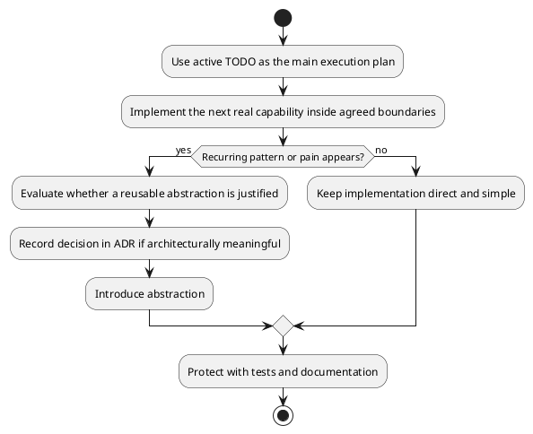

# ADR-006 – TODO-First Delivery with Abstractions Introduced When Needed

- **Status:** Accepted
- **Date:** 2026-04-03
- **Decision Makers:** Project author
- **Related Documents:** `SPEC-1-DefectsStudio-MVP.md`, `ADR-001-modular-domain-monolith.md`, `ADR-005-single-executable-with-selective-technical-libraries.md`

## Context

DefectsStudio is a large scientific desktop application with a broad roadmap, but it is also a solo-developed project maintained primarily by one author with AI assistance. This creates an important implementation constraint:

- the project needs architectural discipline,
- but it must also remain practical to build incrementally,
- and it cannot afford excessive framework ceremony or speculative abstractions too early.

The project already has an explicit execution backlog in the form of a detailed TODO plan. That backlog provides a natural implementation order and already structures the near-term work. At the same time, there are several architectural mechanisms that are likely to become useful later, such as:

- a more formal `AnalysisRunService`,
- more explicit module APIs,
- more formalized derived-data lifecycle handling,
- transactional save semantics,
- broader execution/caching patterns.

The question is not whether such mechanisms can be useful, but **when** they should be introduced.

## Decision

DefectsStudio will follow a **TODO-first delivery strategy** with **architectural abstractions introduced when they become necessary**.

This means:

- the active TODO remains the primary execution plan,
- implementation proceeds in a practical and direct way within the agreed architectural boundaries,
- larger abstractions are introduced only when recurring patterns, maintenance pain, or architectural pressure clearly justify them.

This is the default implementation philosophy for the project.

## Meaning of the decision

This decision does **not** mean “ignore architecture until later.”

It means:

- keep boundaries clear from the beginning,
- keep responsibilities separated,
- keep documentation and ADRs current,
- keep tests around risky boundaries,
- but do **not** build large general mechanisms before the codebase truly needs them.

In other words:

- architecture first as **constraints and ownership rules**,
- abstractions later as **earned structure**.

## Why this decision was made

### 1. The project already has a strong execution plan

The detailed TODO backlog already defines a useful implementation order. Replacing that with a speculative abstraction-first buildout would create unnecessary drag.

### 2. Solo development rewards practical progress

A solo-maintained project benefits from direct implementation of real workflows more than from early framework-building. Progress should come from real project needs, not from hypothetical future elegance.

### 3. Premature abstraction increases cost

If large runtime services, generalized APIs, or formal execution frameworks are introduced before stable recurring patterns exist, they risk becoming:

- too abstract,
- poorly shaped,
- expensive to change,
- a source of confusion rather than clarity.

### 4. The architecture still needs discipline

Even if abstractions are delayed, the project still needs explicit boundaries, dependency rules, documentation, and tests. The decision is about timing of formalization, not about abandoning structure.

## Practical interpretation

### What should exist from the beginning

The following are required immediately:

- clear top-level architectural areas,
- folder and namespace boundaries,
- dependency rules,
- domain ownership rules,
- ADRs for major decisions,
- tests around parsers, serialization, and runtime boundaries,
- documentation maintained with the code.

### What may be introduced later when earned

The following are expected to appear only when recurring need justifies them:

- a formal `AnalysisRunService`,
- broader module APIs,
- more formal `AnalysisRecord` lifecycle handling,
- richer `DerivedDataStorage` semantics,
- transactional save model,
- generalized background execution patterns,
- broader caching/fingerprinting infrastructure.

## Examples

### Example A — analysis execution

At first, one or two scientific workflows may be implemented directly through focused use-case logic and adapter calls. That is acceptable.

A broader `AnalysisRunService` should only be formalized once multiple workflows clearly share:

- the same lifecycle,
- the same progress/error model,
- similar persistence needs,
- similar derived-data behavior.

### Example B — derived-data handling

At first, derived outputs may be managed by simple project-side rules and lightweight conventions. A richer indexing/versioning/fingerprinting system should only appear once the volume and complexity of derived outputs make it necessary.

### Example C — module APIs

At first, some module boundaries may remain direct and local as long as responsibilities are still clear. Public stable APIs should be shaped when modules begin to collaborate repeatedly in ways that justify stronger formalization.

## High-level process model

## Benefits

Expected benefits:

- faster progress on real project goals,
- lower risk of over-engineering,
- better fit for solo development,
- architecture remains grounded in actual needs,
- abstractions are shaped by real usage,
- reduced framework overhead early in the project.

## Risks

Main risks:

- useful abstractions may be introduced too late,
- implementation shortcuts may harden into accidental architecture,
- similar workflows may diverge before consolidation,
- developers may misuse this ADR to justify undisciplined coding.

## Mitigations

To reduce those risks:

- keep architectural rules explicit even when implementations are simple,
- document when local solutions are intentionally temporary,
- revisit repeated patterns during milestones or release reviews,
- use ADRs when a recurring pattern becomes important,
- maintain tests so refactoring into a later abstraction stays safe.

## Relation to the overall architecture

This ADR works together with the core architecture decisions:

- modular domain monolith,
- domain as source of truth,
- ECS boundary,
- Storage vs IO split,
- Scientific Runtime boundary,
- one executable with selective technical extraction.

It defines **how** the architecture should be evolved and implemented over time, not a different architecture.

## Forbidden misinterpretations

This ADR must **not** be read as permission to:

- ignore boundaries because “we will clean it up later,”
- place domain logic in UI or renderer code,
- scatter Python execution arbitrarily,
- collapse Storage and IO into one mixed layer,
- skip documentation and tests because the code is “temporary.”

The system must remain disciplined even when abstractions are deferred.

## Acceptance criteria

This ADR should be considered successfully applied when:

- implementation continues to follow the active TODO as the primary delivery plan,
- abstractions are introduced in response to real recurring needs,
- the codebase remains modular and understandable,
- documentation and ADRs continue to explain architectural evolution,
- future refactoring is enabled rather than blocked by early implementation choices.

## Follow-up ADRs

Possible future ADRs may cover:

- formal analysis execution model,
- derived-data lifecycle and indexing,
- transactional project save semantics,
- GPU compute backend evolution,
- future user scripting strategy if it becomes a product requirement.
