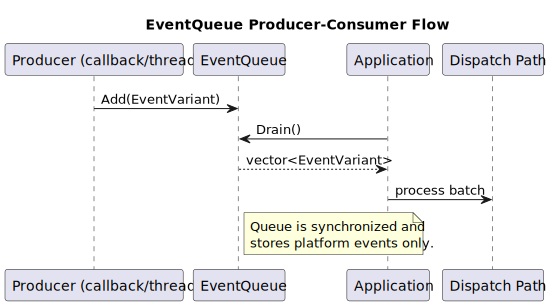

# EventQueue Subsystem

## Purpose / Problem Statement

EventQueue exists to decouple platform-event production from per-frame consumption.

It solves:

- thread-safe accumulation,
- batch drain behavior,
- explicit frame commit point for platform event processing.

It is not a generic subsystem message bus.

## Mental Model

- producers push platform events into queue,
- queue stores `EventVariant` entries,
- `Application` drains queue each frame,
- drained events are dispatched through EventDispatcher path.

## Event Flow and Lifecycle

1. Producer calls `Add(EventVariant)`.
2. Queue stores event in pending vector.
3. `Drain()` swaps pending batch out.
4. application dispatches drained batch.
5. drained event objects are destroyed after dispatch scope.

## Delivery Model / Guarantees

- queue preserves insertion order in drained batch,
- `Drain()` is batch-based and returns a snapshot of pending queue,
- processing moment is controlled by caller (`Application` in platform lane).

## Ownership and Lifetime

- queue owns pending events,
- `Drain()` transfers ownership of batch to caller by move/swap,
- event objects are inline `EventVariant`, not polymorphic heap nodes.

## Threading Model

- queue operations are synchronized by mutex,
- safe for concurrent producers,
- commit behavior depends on where `Drain()` is called.

## API Semantics

### `Configure(initialCapacity, growthStep)`

- initializes queue growth policy and capacity.

### `Add(EventVariant)`

- appends event, growing capacity when needed.

### `Drain()`

- atomically swaps pending storage into returned vector.

### `Size()/Capacity()/Empty()`

- synchronized queue state inspection.

### `Resize()/FitToSize()`

- explicit memory-shape controls.

## Extension Guide

1. Add new platform event type.
2. Register in `EventVariant`.
3. Ensure producers construct correct variant.
4. Verify drain-dispatch integration.
5. Add queue behavior tests.

## Constraints / Non-goals

- not for subsystem pub/sub,
- not a replacement for EventBus,
- not a persistence mechanism.

## Invariants

1. EventQueue stores only platform-lane `EventVariant` values.
2. Drain is the handoff boundary from accumulation to dispatch.
3. Queue behavior is deterministic for insertion-order batches.

## Common Pitfalls

- adding new platform event type but forgetting variant registration,
- assuming queue implies async callback execution (it only defers availability),
- misusing queue as a subsystem communication channel.

## Debugging

- inspect size before and after drain,
- verify producer call sites use `Add` path,
- trace frame order around poll, drain, and dispatch.

## Testing

- add/drain correctness,
- insertion order preservation,
- capacity growth behavior,
- concurrent add safety,
- integration with frame dispatch.
