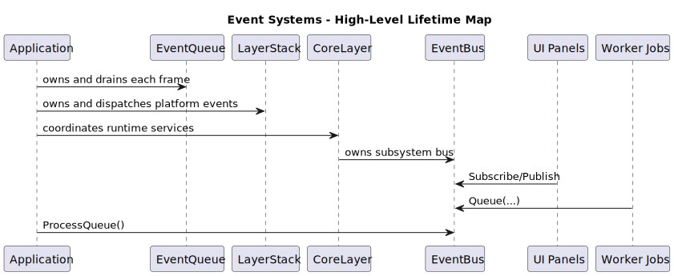

# Event Systems Introduction

## Why DefectStudio Uses Events

DefectStudio is interactive software. Users click, scroll, press keys, trigger jobs, and expect immediate feedback.

An event is a message that says: something happened.

Examples:

- the window was resized,
- the mouse wheel moved,
- a background job completed.

Without events, code usually turns into direct call chains where modules know too much about each other.

## Why There Are Two Event Systems

DefectStudio intentionally keeps two separate systems because they solve different architectural problems.

1. EventDispatcher / EventHandling path:
   routes OS/input/window/application-lifecycle events through `Application`, `EventQueue`, and `LayerStack`.
2. EventBus path:
   routes subsystem-level messages between independent modules.

This separation prevents architecture drift. Platform input routing and subsystem messaging are different concerns and must remain different systems.

## Comparison

| Question                | EventDispatcher                 | EventBus                                                      |
| ----------------------- | ------------------------------- | ------------------------------------------------------------- |
| Main purpose            | platform event routing          | subsystem-to-subsystem communication                          |
| Typical source          | OS/GLFW callbacks               | application code (panels, jobs, services)                     |
| Processing moment owner | `Application` frame pipeline    | publisher (`Publish`) or bus queue (`Queue` + `ProcessQueue`) |
| Handling endpoint       | `Layer::OnEvent(Event&)`        | subscriber callbacks                                          |
| Typical use             | mouse/keyboard/window/lifecycle | notifications, job status, module updates                     |

## High-Level Lifetime Map

## Reading Path

1. Read [Overview](overview.md) for architecture-level understanding and usage scenarios.
2. Read [For Programmers](for-programmers.md) for contracts, guarantees, threading, and extension rules.
3. Use subsystem pages when implementing changes:
   - [EventDispatcher](event-dispatcher.md)
   - [EventBus](event-bus.md)
   - [EventQueue](event-queue.md)
   - [Design Decisions](design-decisions.md)
