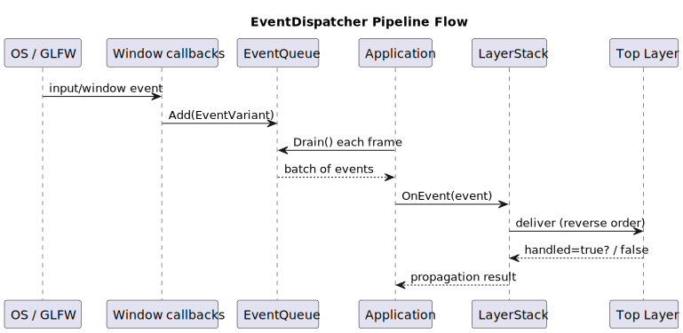
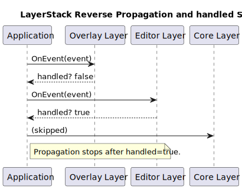
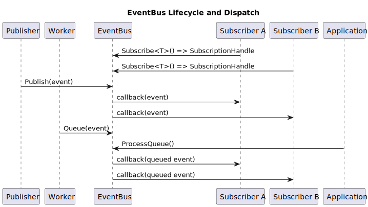

# Event Systems Overview

This page is for a technical reader who wants to understand system behavior and architectural choices without implementation-level C++ details.

## System Role in the Application

DefectStudio uses events to decouple event production from event handling and to keep interaction flow deterministic.

There are two event systems:

- EventDispatcher path for platform/input flow,
- EventBus path for subsystem messaging.

They are complementary, not interchangeable.

## How to Think About Both Systems

- EventDispatcher path is the input/runtime shell lane.
- EventBus is the internal communication lane.

If the source is OS/window/input and flow ordering through layers matters, use EventDispatcher.
If the source is module state change and independent consumers should react, use EventBus.

## EventDispatcher Path (High-Level)

### Problem It Solves

Collect low-level events, process them at a controlled frame moment, and propagate them through layers in deterministic order.

### Event Flow

1. OS/GLFW callback produces a concrete platform event.
2. Event is queued into `EventQueue` as `EventVariant`.
3. `Application` drains the queue during frame update.
4. Event enters `Application::OnEvent(...)`.
5. Event is propagated through `LayerStack` in reverse order.
6. A layer may stop further propagation by setting `handled = true`.

### Layer Order and Propagation Stop

## EventBus Path (High-Level)

### Problem It Solves

Allow independent modules to communicate without direct module-to-module dependencies.

### Event Flow

1. Producer publishes a bus event type.
2. Subscribers registered for this type are invoked.
3. Delivery is immediate (`Publish`) or deferred (`Queue` + `ProcessQueue`).

## EventQueue Path (High-Level)

### Why It Exists

`EventQueue` separates production from consumption in the platform lane.

### What It Gives

- thread-safe accumulation,
- per-frame batch drain,
- explicit commit point for visible runtime behavior.

## Decision Table

| Scenario                                             | Use             | Why                                      |
| ---------------------------------------------------- | --------------- | ---------------------------------------- |
| Mouse wheel zoom in viewport                         | EventDispatcher | platform input + layer propagation order |
| Window close request                                 | EventDispatcher | shell lifecycle flow                     |
| "Job completed" update for several panels            | EventBus        | decoupled fan-out                        |
| Diagnostics panel reacts to import state             | EventBus        | producer and consumers stay independent  |
| Delaying platform-event processing to frame boundary | EventQueue      | controlled processing moment             |

## Benefits of the Split

- lower coupling,
- clear ownership of processing moments,
- easier debugging (know which lane to inspect),
- safer concurrency model (queue-first for commit paths),
- clearer extension rules.
