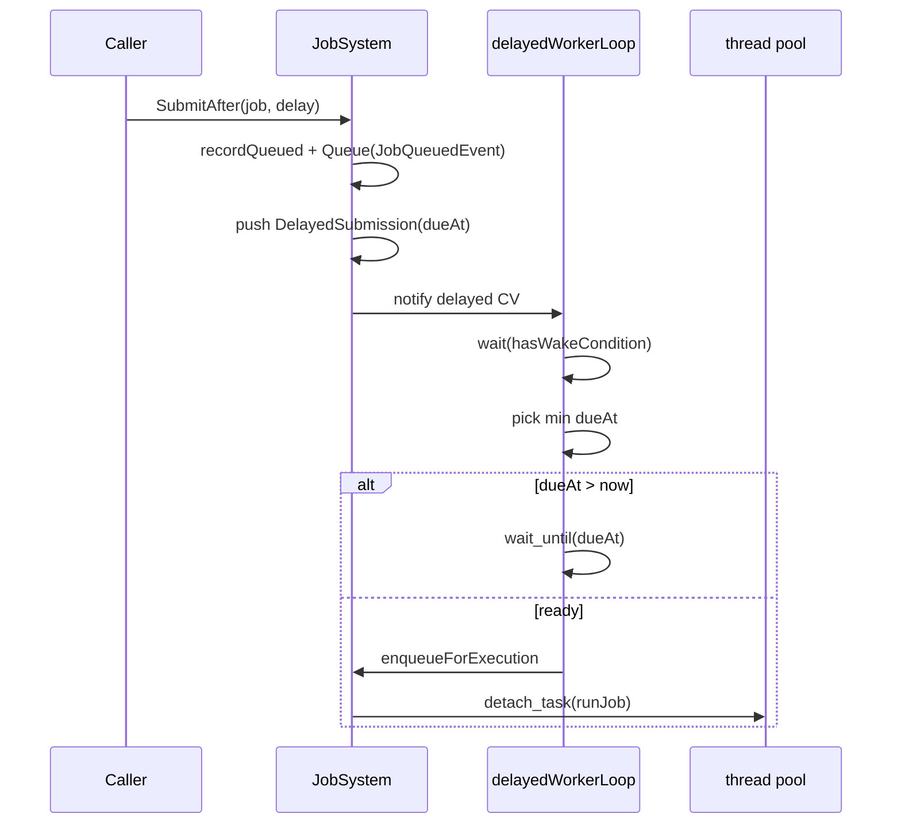

# Job + Progress Systems For Developers (Deep Dive)

Ta strona jest dla osob rozwijajacych implementacje.

## Kod jako zrodlo prawdy

Kluczowe pliki:
- `src/Core/JobSystem/JobSystem.hpp`
- `src/Core/JobSystem/JobSystem.cpp`
- `src/Core/JobSystem/JobContext.hpp`
- `src/Core/JobSystem/JobSystemTypes.hpp`
- `src/Core/ProgressTrackingSystem/ProgressTracker.hpp`
- `src/Core/ProgressTrackingSystem/ProgressTracker.cpp`
- `src/Core/EventSystem/BusEventSystem/EventBus.hpp`
- `src/Core/EventSystem/BusEventSystem/EventBus.cpp`
- `src/App/Events/JobEvents.hpp`
- `tests/Core/JobSystem/*.cpp`
- `tests/Core/ProgressTracking/ProgressTrackerTests.cpp`

## Wewnetrzne punkty krytyczne

### JobSystem

- `submitInternal`
  - gatekeeper dla immediate i delayed submission.
- `runJob`
  - mapowanie callbackow `JobContext`, ustawianie final status, publikacja eventow terminalnych.
- `waitForJobCooperative`
  - zabezpieczenie anty-deadlock dla nested waits.
- `delayedWorkerLoop`
  - harmonogram opoznionych zadan oparty o `dueAt`.
- `threadCountWorkerLoop`
  - asynchroniczny channel zmiany liczby workerow.

### ProgressTracker

- `onQueued/onStarted/onProgress/onCompleted/onCancelled/onFailed`
  - mapowanie lifecycle eventow na read-model.

### EventBus

- `dispatchByType`
- `ProcessQueue`
- `unsubscribeById`

## Synchroniczne vs asynchroniczne

Synchroniczne (caller thread):
- `Submit`/`SubmitAfter` do momentu utworzenia rekordu i `Queue(JobQueuedEvent)`.
- mutacje sterujace (`RequestCancel`, `Resume`, `Reset`, `Retry`, `RemoveFromHistory`).
- gettery snapshotow i logow.

Asynchroniczne:
- `runJob` (thread pool),
- `delayedWorkerLoop` (`std::jthread`),
- `threadCountWorkerLoop` (`std::jthread`),
- dostarczenie eventow queued dopiero przy `EventBus::ProcessQueue`.

## Synchronizacja: gdzie i jak

### JobSystem

- `m_RecordsMutex`: `m_Records` i mutacje snapshot/log.
- `m_DelayedMutex` + `m_DelayedCv`: kolejka opozniona i budzenia.
- `m_ThreadCountMutex` + `m_ThreadCountCv`: `m_PendingThreadCount`.
- `m_NextId`, `m_ShutdownRequested`: atomiki.

### ProgressTracker

- `m_Mutex` chroni `m_Entries`.

### EventBus

- `m_QueueMutex` chroni `m_Queue`.
- modyfikacje listenerow podczas dispatch sa deferowane (`pendingAdditions`, `pendingRemoval`).

## Scheduler i delayed jobs

### Sequence: delayed submission



### Diagram kolejki/schedulera

```mermaid
flowchart TD
  A[SubmitAfter] --> B[DelayedSubmission {id, dueAt}]
  B --> C[Delayed queue]
  C --> D[delayedWorkerLoop]
  D --> E{dueAt reached?}
  E -- no --> F[wait_until(next dueAt)]
  E -- yes --> G[enqueueForExecution]
  G --> H[runJob on pool]
```

## Event system behavior dla job lifecycle

- `JobSystem` emituje wyłącznie przez `EventBus::Queue(Job*Event)`.
- `EventBus::ProcessQueue` jest jedynym commit-pointem dostarczenia queued events.
- `ProgressTracker` aktualizuje model w handlerach `on*`.

## Raportowanie i agregacja progresu

Raportowanie:
- `JobContext` -> callbacki ustawione w `runJob`.
- callbacki trafiaja do `updateProgress/updateStage/updateMessage`.
- kazda aktualizacja skutkuje `JobProgressEvent`.

Agregacja:
- `ProgressTracker::onProgress` aktualizuje work counters i stage/message.
- `onCompleted` domyka `completedWork` do `totalWork`, gdy potrzeba.

## Race conditions: gdzie byly/bylyby problemy

1. Concurrent submit i odczyt rekordow
- Ryzyko: uszkodzenie mapy rekordow.
- Rozwiazanie: `m_RecordsMutex`.

2. Listener unsubscribe/subscribe podczas dispatch
- Ryzyko: invalidacja iteratora i niedeterministyczna kolejnosc.
- Rozwiazanie: `pendingAdditions` i `pendingRemoval`.

3. Parent wait na child przy jednym workerze
- Ryzyko: deadlock.
- Rozwiazanie: fail-fast w `waitForJobCooperative` dla single-worker parent wait.

4. Testowy race na wspolnym `executionOrder`
- Ryzyko: flaky wynik nested submission tests.
- Rozwiazanie: synchronizacja zapisu przez mutex w helperach testowych.

## Thread safety (jawnie)

Bezpieczne przy wspolbieznym uzyciu:
- submit/control/getter API `JobSystem`,
- odczyty i update `ProgressTracker`,
- enqueue/dequeue eventow przez `EventBus` queue API.

Wymaga dyscypliny:
- kod `IJob::Execute` jest user code; runtime nie robi automatycznej synchronizacji zasobow, ktore job dotyka,
- logika aplikacji musi regularnie wywolywac `ProcessQueue`.

## Trade-offs i decyzje projektowe

- Queue-first event delivery:
  - plus: kontrolowany commit-point i przewidywalny przeplyw,
  - minus: opoznienie widocznosci bez `ProcessQueue`.

- Cooperative cancellation:
  - plus: brak brutalnego przerywania watku,
  - minus: stop zalezy od miejsc sprawdzania cancel.

- Polling (`sleep_for(1ms)`) w `waitForJobCooperative`:
  - plus: prostota,
  - minus: dodatkowe wake-ups i koszt przy wysokiej skali.

## Miejsca latwe do zepsucia

- `runJob`: centralny punkt lifecycle i exception->status mapping.
- `submitInternal`: wspolna semantyka immediate + delayed.
- `delayedWorkerLoop`: logika `wait_until` i wyboru `dueAt`.
- `EventBus::dispatchByType`: semantyka `stopPropagation` i deferred changes.
- `ProgressTracker::onProgress`: spojnosc status/progress/stage/message.

## Proponowane ulepszenia

1. Zastapic polling w cooperative wait przez sygnalizacje condition-variable per job.
2. Dodac bardziej jawny sygnal bledu dla fail-fast nested wait (zamiast samego `0`).
3. Rozwazyc ograniczanie czestotliwosci `JobProgressEvent` dla bardzo chatty jobs.
4. Ujednolicic helper resetowania snapshotu (wspolna funkcja dla `Reset`, `Retry`, `Resume`).
