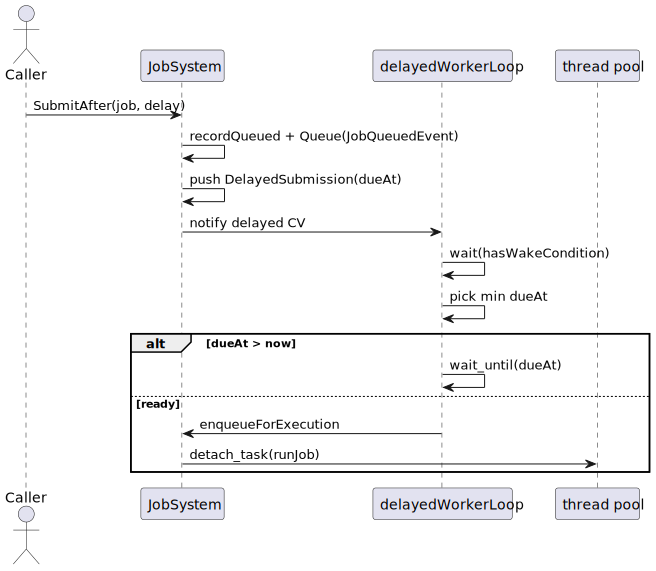
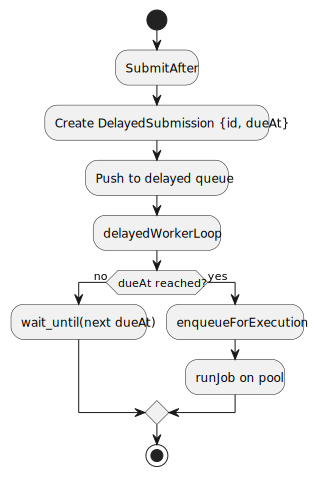

# Job + Progress Systems For Developers (Deep Dive)

This page is for maintainers working on implementation internals.

## Code as Source of Truth

Key files:
- `src/Core/JobSystem/JobSystem.hpp`
- `src/Core/JobSystem/JobSystem.cpp`
- `src/Core/JobSystem/JobContext.hpp`
- `src/Core/JobSystem/JobSystemTypes.hpp`
- `src/Core/ProgressTrackingSystem/ProgressTracker.hpp`
- `src/Core/ProgressTrackingSystem/ProgressTracker.cpp`
- `src/Core/EventSystem/BusEventSystem/EventBus.hpp`
- `src/Core/EventSystem/BusEventSystem/EventBus.cpp`
- `src/App/Events/JobEvents.hpp`
- `tests/Core/JobSystem/*.cpp`
- `tests/Core/ProgressTracking/ProgressTrackerTests.cpp`

## Internal Critical Points

### JobSystem

- `submitInternal`
  - gatekeeper for immediate and delayed submission.
- `runJob`
  - wires `JobContext` callbacks, sets final status, emits terminal events.
- `waitForJobCooperative`
  - anti-deadlock guard for nested waits.
- `delayedWorkerLoop`
  - delayed scheduler based on `dueAt`.
- `threadCountWorkerLoop`
  - asynchronous worker-count channel.

### ProgressTracker

- `onQueued/onStarted/onProgress/onCompleted/onCancelled/onFailed`
  - maps lifecycle events into read model.

### EventBus

- `dispatchByType`
- `ProcessQueue`
- `unsubscribeById`

## Synchronous vs Asynchronous

Synchronous (caller thread):
- `Submit`/`SubmitAfter` until record creation and `Queue(JobQueuedEvent)`.
- control mutations (`RequestCancel`, `Resume`, `Reset`, `Retry`, `RemoveFromHistory`).
- snapshot/log getters.

Asynchronous:
- `runJob` (thread pool),
- `delayedWorkerLoop` (`std::jthread`),
- `threadCountWorkerLoop` (`std::jthread`),
- queued event delivery only on `EventBus::ProcessQueue`.

## Synchronization Model

### JobSystem

- `m_RecordsMutex`: `m_Records` and snapshot/log mutations.
- `m_DelayedMutex` + `m_DelayedCv`: delayed queue and wakeups.
- `m_ThreadCountMutex` + `m_ThreadCountCv`: `m_PendingThreadCount`.
- `m_NextId`, `m_ShutdownRequested`: atomics.

### ProgressTracker

- `m_Mutex` protects `m_Entries`.

### EventBus

- `m_QueueMutex` protects `m_Queue`.
- listener mutation during dispatch is deferred (`pendingAdditions`, `pendingRemoval`).

## Scheduler and Delayed Jobs

### Sequence: delayed submission

### Delayed queue/scheduler flow

## Event System Behavior for Job Lifecycle

- `JobSystem` emits through `EventBus::Queue(Job*Event)`.
- `EventBus::ProcessQueue` is the commit point for queued events.
- `ProgressTracker` updates state in `on*` handlers.

## Progress Reporting and Aggregation

Reporting:
- `JobContext` calls callbacks configured in `runJob`.
- callbacks route into `updateProgress/updateStage/updateMessage`.
- each update produces `JobProgressEvent`.

Aggregation:
- `ProgressTracker::onProgress` updates work counters and stage/message.
- `onCompleted` closes `completedWork` to `totalWork` when needed.

## Race Conditions: Main Risk Areas

1. Concurrent submit and record reads
- Risk: record map corruption.
- Mitigation: `m_RecordsMutex`.

2. Subscribe/unsubscribe during dispatch
- Risk: iterator invalidation and nondeterministic ordering.
- Mitigation: `pendingAdditions` and `pendingRemoval`.

3. Parent wait on child with a single worker
- Risk: deadlock.
- Mitigation: fail-fast behavior in `waitForJobCooperative`.

4. Test race on shared `executionOrder`
- Risk: flaky nested-submission tests.
- Mitigation: mutex-protected writes in test helpers.

## Thread-Safety Contract

Safe for concurrent use:
- `JobSystem` submit/control/getter API,
- `ProgressTracker` reads and updates,
- `EventBus` queue operations.

Requires discipline:
- `IJob::Execute` is user code; runtime does not auto-synchronize domain resources touched by jobs,
- application logic must call `ProcessQueue` regularly.

## Trade-Offs and Decisions

- Queue-first event delivery:
  - plus: explicit commit point and predictable flow,
  - minus: visibility lag without `ProcessQueue`.

- Cooperative cancellation:
  - plus: no forced thread interruption,
  - minus: stop latency depends on cancellation checkpoints.

- Polling (`sleep_for(1ms)`) in `waitForJobCooperative`:
  - plus: simple behavior,
  - minus: extra wakeups and overhead under high scale.

## Easy-to-Break Areas

- `runJob`: central lifecycle and exception-to-status mapping.
- `submitInternal`: shared semantics for immediate + delayed paths.
- `delayedWorkerLoop`: `wait_until` timing and `dueAt` selection logic.
- `EventBus::dispatchByType`: `stopPropagation` and deferred-listener semantics.
- `ProgressTracker::onProgress`: consistency of status/progress/stage/message.

## Suggested Improvements

1. Replace cooperative polling with condition-variable signaling per job.
2. Add explicit error signaling for fail-fast nested wait (instead of plain `0`).
3. Consider throttling `JobProgressEvent` for very chatty jobs.
4. Consolidate snapshot reset logic used by `Reset`, `Retry`, and `Resume`.
