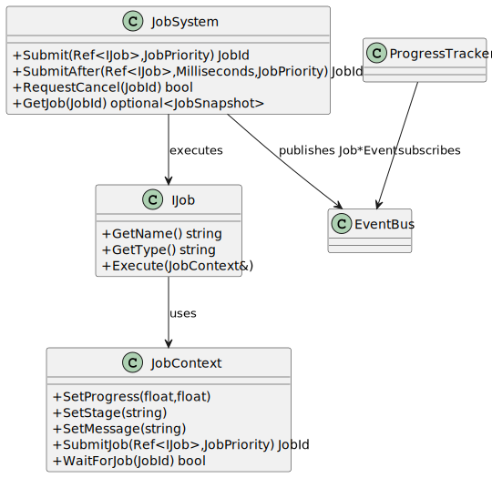

# Job + Progress Systems For Users

This page is for application developers who want to use the API without diving into engine internals.

## Mental Model

- `JobSystem` executes asynchronous work.
- `JobContext` is the runtime reporting and control channel available inside `Execute`.
- `EventBus` transports lifecycle updates.
- `ProgressTracker` exposes UI-friendly snapshots.

## Class Diagram



## Public API

### JobSystem

Contract file: `src/Core/JobSystem/JobSystem.hpp`

Lifecycle:
- `JobSystem(WeakRef<EventBus> eventBus = {}, std::size_t threadCount = 0)`
- `~JobSystem()`
- `void Shutdown()`

Submission:
- `JobId Submit(const Ref<IJob>& job, JobPriority priority = JobPriority::Normal)`
- `JobId SubmitAfter(const Ref<IJob>& job, Time::Milliseconds delay, JobPriority priority = JobPriority::Normal)`

Control:
- `bool RequestCancel(JobId id)`
- `bool Resume(JobId id)`
- `bool Reset(JobId id)`
- `bool Retry(JobId id, JobPriority priority = JobPriority::Normal)`
- `bool RemoveFromHistory(JobId id)`

Runtime config:
- `std::size_t GetThreadCount() const`
- `bool SetThreadCount(std::size_t threadCount)`

Query:
- `std::optional<JobSnapshot> GetJob(JobId id) const`
- `std::vector<JobSnapshot> GetAllJobs() const`
- `std::vector<JobSnapshot> GetActiveJobs() const`
- `std::vector<JobSnapshot> GetFinishedJobs() const`
- `std::vector<JobLogEntry> GetLogs(JobId id) const`

### JobContext

Contract file: `src/Core/JobSystem/JobContext.hpp`

Progress/state reporting:
- `SetProgress(float completedWork, float totalWork)`
- `SetStage(const std::string& stage)`
- `SetMessage(const std::string& message)`

Logging:
- `LogDebug`, `LogInfo`, `LogWarning`, `LogError`

Cancellation:
- `bool IsCancellationRequested() const`
- `void ThrowIfCancellationRequested() const`

Nested jobs:
- `JobId SubmitJob(const Ref<IJob>& job, JobPriority priority = JobPriority::Normal) const`
- `bool WaitForJob(JobId id) const`
- `JobId SubmitJobSequential(const Ref<IJob>& job, JobPriority priority = JobPriority::Normal) const`

### ProgressTracker

Contract file: `src/Core/ProgressTrackingSystem/ProgressTracker.hpp`

- `void BindEventBus(WeakRef<EventBus> eventBus)`
- `void UnbindEventBus()`
- `std::optional<ProgressEntrySnapshot> GetSnapshot(JobId id) const`
- `std::vector<ProgressEntrySnapshot> GetAllSnapshots() const`
- `std::vector<ProgressEntrySnapshot> GetActiveSnapshots() const`
- `std::vector<ProgressEntrySnapshot> GetFinishedSnapshots() const`
- `bool RemoveEntry(JobId id)`

## Class Responsibilities

- `IJob`: business logic of one task.
- `JobSystem`: scheduling and lifecycle state.
- `JobContext`: the supported reporting/control channel inside `Execute`.
- `ProgressTracker`: read model for UI.

## `WaitForJob` and `waitForJobCooperative`

`waitForJobCooperative` is an internal `JobSystem` method (not public API). You do not call it directly.

As a user, you call:
- `JobContext::WaitForJob(id)` when a parent job needs to wait for a child.
- `JobContext::SubmitJobSequential(...)` when you want submit + cooperative wait in one operation.

Behavior to know:
- Waiting is cooperative and cancellation-aware.
- In a single-worker deadlock-prone parent->child case, sequential wait can fail fast (returns `0` from `SubmitJobSequential`) instead of hard deadlocking.

Usage guidance:
- Prefer small child jobs.
- Avoid long blocking waits in parent jobs.
- If sequential dependency is weak, prefer asynchronous fan-out and aggregate later.

## Practical Example: Single Import Job with Real Progress Tracking

```cpp
class CsvImportJob final : public IJob {
public:
    explicit CsvImportJob(std::vector<std::string> files)
        : m_Files(std::move(files)) {}

    std::string GetName() const override { return "CsvImportJob"; }
    std::string GetType() const override { return "Import"; }

    void Execute(JobContext& context) override {
        const float totalFiles = static_cast<float>(m_Files.size());
        context.SetStage("scan");
        context.SetMessage("Preparing import");
        context.SetProgress(0.0f, totalFiles);

        for (std::size_t i = 0; i < m_Files.size(); ++i) {
            context.ThrowIfCancellationRequested();

            const std::string& path = m_Files[i];
            context.SetStage("parse");
            context.SetMessage("Importing: " + path);

            // Domain work example:
            // - open CSV
            // - validate headers
            // - transform rows
            // - write to storage
            ImportOneCsvFile(path);

            context.SetProgress(static_cast<float>(i + 1), totalFiles);
            context.LogInfo("Imported file: " + path);
        }

        context.SetStage("done");
        context.SetMessage("Import finished");
    }

private:
    std::vector<std::string> m_Files;
};

auto bus = CreateRef<EventBus>();
ProgressTracker tracker(CreateWeakRef(bus));
JobSystem system(CreateWeakRef(bus), 4);

auto id = system.Submit(CreateRef<CsvImportJob>(
    std::vector<std::string>{"customers.csv", "orders.csv", "invoices.csv"}
));

// Application update loop (required for tracker updates from queued events):
// bus->ProcessQueue();

// Example UI polling:
// if (auto snapshot = tracker.GetSnapshot(id)) {
//     RenderProgressBar(snapshot->completedWork / snapshot->totalWork);
//     RenderLabel(snapshot->stage + " - " + snapshot->message);
// }
```

## Best Practices

- Keep `Execute` stage-based and bounded.
- Check cancellation regularly (`ThrowIfCancellationRequested` or `IsCancellationRequested`).
- Use `SubmitAfter` only for true business delays.
- Keep progress scale stable (`totalWork`).
- Call `EventBus::ProcessQueue()` regularly if UI depends on `ProgressTracker`.

## Common Mistakes

- Assuming `RequestCancel` force-stops code immediately.
- Forgetting `EventBus::ProcessQueue()` (tracker will appear stale).
- Blocking workers unnecessarily with heavy waiting patterns.
- Implementing custom blocking wait loops outside `JobContext` APIs.

## FAQ

Q: Why can `SubmitJobSequential` return `0`?

A: In a deadlock-prone single-worker parent->child scenario, sequential wait fails fast by design.

Q: Why does tracker show old state?

A: Most often, queued events are not being committed via `ProcessQueue()` in the main loop.

## API Cheat Sheet

- Start: `JobSystem(eventBus, threadCount)`
- Submit: `Submit`, `SubmitAfter`
- Control: `RequestCancel`, `Resume`, `Retry`, `Reset`, `RemoveFromHistory`
- Query: `GetJob`, `GetActiveJobs`, `GetFinishedJobs`, `GetLogs`
- Nested: `SubmitJob`, `WaitForJob`, `SubmitJobSequential`
- Tracker: `GetAllSnapshots`, `GetActiveSnapshots`, `GetFinishedSnapshots`
