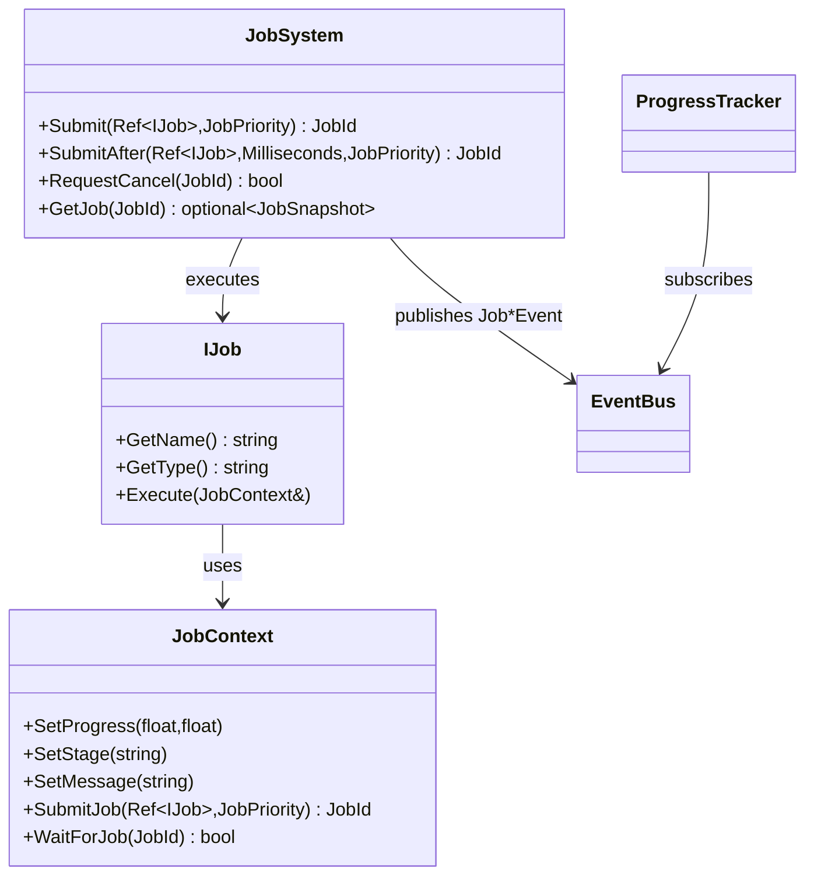

# Job + Progress Systems For Users

Ta strona jest dla osoby, ktora chce korzystac z API bez wchodzenia w internals.

## Mentalny model

- `JobSystem` to wykonawca pracy.
- `JobContext` to kanal raportowania stanu i sterowania nested jobs.
- `EventBus` to transport eventow.
- `ProgressTracker` to read-model dla UI.

## Publiczne API

### JobSystem

Plik kontraktu: `src/Core/JobSystem/JobSystem.hpp`

Lifecycle:
- `JobSystem(WeakRef<EventBus> eventBus = {}, std::size_t threadCount = 0)`
- `~JobSystem()`
- `void Shutdown()`

Submission:
- `JobId Submit(const Ref<IJob>& job, JobPriority priority = JobPriority::Normal)`
- `JobId SubmitAfter(const Ref<IJob>& job, Time::Milliseconds delay, JobPriority priority = JobPriority::Normal)`

Control:
- `bool RequestCancel(JobId id)`
- `bool Resume(JobId id)`
- `bool Reset(JobId id)`
- `bool Retry(JobId id, JobPriority priority = JobPriority::Normal)`
- `bool RemoveFromHistory(JobId id)`

Runtime config:
- `std::size_t GetThreadCount() const`
- `bool SetThreadCount(std::size_t threadCount)`

Query:
- `std::optional<JobSnapshot> GetJob(JobId id) const`
- `std::vector<JobSnapshot> GetAllJobs() const`
- `std::vector<JobSnapshot> GetActiveJobs() const`
- `std::vector<JobSnapshot> GetFinishedJobs() const`
- `std::vector<JobLogEntry> GetLogs(JobId id) const`

### JobContext

Plik kontraktu: `src/Core/JobSystem/JobContext.hpp`

Raportowanie:
- `SetProgress(float completedWork, float totalWork)`
- `SetStage(const std::string& stage)`
- `SetMessage(const std::string& message)`

Logowanie:
- `LogDebug`, `LogInfo`, `LogWarning`, `LogError`

Cancellation:
- `bool IsCancellationRequested() const`
- `void ThrowIfCancellationRequested() const`

Nested jobs:
- `JobId SubmitJob(const Ref<IJob>& job, JobPriority priority = JobPriority::Normal) const`
- `bool WaitForJob(JobId id) const`
- `JobId SubmitJobSequential(const Ref<IJob>& job, JobPriority priority = JobPriority::Normal) const`

### ProgressTracker

Plik kontraktu: `src/Core/ProgressTrackingSystem/ProgressTracker.hpp`

- `void BindEventBus(WeakRef<EventBus> eventBus)`
- `void UnbindEventBus()`
- `std::optional<ProgressEntrySnapshot> GetSnapshot(JobId id) const`
- `std::vector<ProgressEntrySnapshot> GetAllSnapshots() const`
- `std::vector<ProgressEntrySnapshot> GetActiveSnapshots() const`
- `std::vector<ProgressEntrySnapshot> GetFinishedSnapshots() const`
- `bool RemoveEntry(JobId id)`

## Odpowiedzialnosc klas (w praktyce)

- `IJob`: logika biznesowa pojedynczego zadania.
- `JobSystem`: planowanie i lifecycle.
- `JobContext`: jedyny poprawny kanal raportowania z `Execute`.
- `ProgressTracker`: widok stanu dla UI.

## UML relacji klas



## Praktyczne scenariusze

### 1) Pojedynczy job

```cpp
class ImportJob final : public DefectStudio::IJob {
public:
    std::string GetName() const override { return "ImportJob"; }
    std::string GetType() const override { return "IO"; }

    void Execute(DefectStudio::JobContext& context) override {
        context.SetStage("prepare");
        context.SetProgress(0.0f, 3.0f);

        for (int step = 1; step <= 3; ++step) {
            context.ThrowIfCancellationRequested();
            context.SetProgress(static_cast<float>(step), 3.0f);
        }

        context.SetStage("done");
        context.SetMessage("Import zakonczony");
    }
};

DefectStudio::JobSystem system;
auto id = system.Submit(DefectStudio::CreateRef<ImportJob>());
```

### 2) Job wieloetapowy i nested child

```cpp
class ChildJob final : public DefectStudio::IJob {
public:
    std::string GetName() const override { return "ChildJob"; }
    std::string GetType() const override { return "Pipeline"; }

    void Execute(DefectStudio::JobContext& context) override {
        context.SetStage("child");
        context.SetProgress(1.0f, 1.0f);
    }
};

class ParentJob final : public DefectStudio::IJob {
public:
    std::string GetName() const override { return "ParentJob"; }
    std::string GetType() const override { return "Pipeline"; }

    void Execute(DefectStudio::JobContext& context) override {
        context.SetStage("submit-child");
        auto childId = context.SubmitJobSequential(DefectStudio::CreateRef<ChildJob>());
        if (childId == 0) {
            context.LogWarning("Child nie zakonczyl sie sekwencyjnie");
        }
        context.SetProgress(1.0f, 1.0f);
    }
};
```

### 3) Subskrypcja eventow + tracker

```cpp
auto bus = DefectStudio::CreateRef<DefectStudio::EventBus>();
DefectStudio::ProgressTracker tracker(DefectStudio::CreateWeakRef(bus));
DefectStudio::JobSystem system(DefectStudio::CreateWeakRef(bus));

auto sub = bus->Subscribe<DefectStudio::JobCompletedEvent>(
    [](const DefectStudio::JobCompletedEvent& e) {
        (void)e; // telemetry / UI signal
    }
);

// update loop:
// bus->ProcessQueue();
```

## Dobre praktyki

- Trzymaj `Execute` krotkie i etapowe.
- Sprawdzaj cancel regularnie (`ThrowIfCancellationRequested` lub `IsCancellationRequested`).
- Uzywaj `SubmitAfter` tylko do realnych opoznien biznesowych.
- Utrzymuj stabilna skale postepu (`totalWork`).

## Typowe bledy

- Zakladanie, ze `RequestCancel` zatrzyma kod natychmiast.
- Brak `EventBus::ProcessQueue()` (tracker nie bedzie aktualny).
- Blokowanie workerow bez potrzeby.
- Wlasne blokujace waity dla nested jobs poza `JobContext` API.

## FAQ

P: Dlaczego `SubmitJobSequential` czasem zwraca `0`?

O: W trybie pojedynczego workera czekanie parent->child fail-fast, zeby uniknac deadlocka.

P: Dlaczego tracker ma stary stan?

O: Najczesciej brakuje `ProcessQueue` w petli aplikacji.

## API cheat sheet

- Start: `JobSystem(eventBus, threadCount)`
- Submit: `Submit`, `SubmitAfter`
- Control: `RequestCancel`, `Resume`, `Retry`, `Reset`, `RemoveFromHistory`
- Query: `GetJob`, `GetActiveJobs`, `GetFinishedJobs`, `GetLogs`
- Nested: `SubmitJob`, `WaitForJob`, `SubmitJobSequential`
- Tracker: `GetAllSnapshots`, `GetActiveSnapshots`, `GetFinishedSnapshots`
