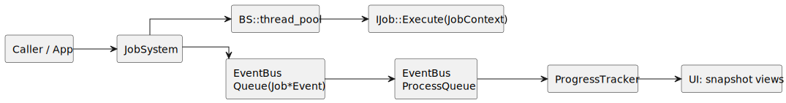

# Job + Progress Systems Overview

This section describes `JobSystem` and `ProgressTracker` together because they operate as one runtime chain:
- `JobSystem` executes work,
- `EventBus` transports lifecycle updates,
- `ProgressTracker` builds a UI-facing read model.

## Problem This Solves

Without this stack:
- long-running work would block the main thread,
- UI would not have a stable progress model,
- modules would be tightly coupled.

With this stack:
- jobs run asynchronously,
- status is observable and queryable,
- integration is event-driven.

## High-Level Architecture

## Core Components and Roles

- `IJob`
  - domain work contract (`GetName`, `GetType`, `Execute`).
- `JobSystem`
  - submit/control/query API,
  - snapshot and log updates,
  - delayed scheduling,
  - runtime worker-count changes.
- `JobContext`
  - runtime API for job code (progress, stage, message, logging, cancellation, nested jobs).
- `EventBus`
  - lifecycle transport (`Queue` + `ProcessQueue`).
- `ProgressTracker`
  - subscribes to events and builds query snapshots for UI.

## End-to-End Flow

1. Application calls `Submit` or `SubmitAfter`.
2. `JobSystem` creates a `Queued` record and queues `JobQueuedEvent`.
3. Job goes to pool immediately, or to delayed queue until `dueAt`.
4. Worker starts `runJob`; status moves to `Running`.
5. `IJob::Execute` reports updates through `JobContext`.
6. `JobSystem` queues `JobProgressEvent` updates.
7. On finish, it queues `JobCompletedEvent` / `JobCancelledEvent` / `JobFailedEvent`.
8. `EventBus::ProcessQueue()` dispatches queued events to `ProgressTracker`.
9. UI reads `ProgressEntrySnapshot` through `GetActiveSnapshots` / `GetFinishedSnapshots`.

## Short Usage Story

User starts an import. `JobSystem` runs `ImportJob` on a worker and emits lifecycle events. Main update loop calls `EventBus::ProcessQueue()`, `ProgressTracker` updates snapshots, and monitoring UI displays stage and progress until completion.

## Job Lifecycle

- `Queued`: record exists, waiting for execution.
- `Running`: worker entered `Execute`.
- `Completed` / `Cancelled` / `Failed`: terminal state.
- Snapshot and logs remain queryable until `RemoveFromHistory`.

## Thread-Safety Summary

- `JobSystem`:
  - `m_RecordsMutex` protects `m_Records`,
  - `m_DelayedMutex` + `m_DelayedCv` protects delayed queue,
  - `m_ThreadCountMutex` + `m_ThreadCountCv` protects thread-count channel,
  - `m_NextId` and `m_ShutdownRequested` are atomics.
- `ProgressTracker`: `m_Mutex` protects `m_Entries`.
- `EventBus`: `m_QueueMutex` protects queued events.

`IJob::Execute` code remains user-authored and is not automatically synchronized by runtime.

## Code as Source of Truth

Contracts and behavior in this section come directly from:
- `src/Core/JobSystem/JobSystem.hpp`
- `src/Core/JobSystem/JobSystem.cpp`
- `src/Core/ProgressTrackingSystem/ProgressTracker.hpp`
- `src/Core/ProgressTrackingSystem/ProgressTracker.cpp`
- `src/Core/EventSystem/BusEventSystem/EventBus.hpp`
- `src/App/Events/JobEvents.hpp`
- `tests/Core/JobSystem/*.cpp`
- `tests/Core/ProgressTracking/ProgressTrackerTests.cpp`
