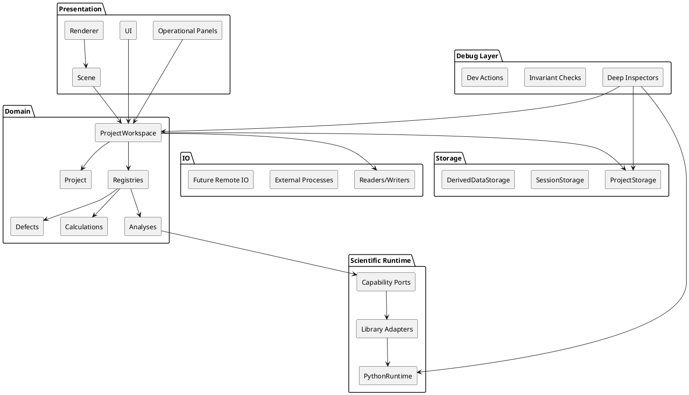

# DefectsStudio – Project Overview

> **Document Version:** 4.0  
> **Update Date:** 2026-04-05  
> **Status:** Pre-Alpha / Active Architecture and Implementation Phase  
> **Audience:** New contributors, future maintainers, and the project author returning after a break

---

## What is DefectsStudio

DefectsStudio is a desktop scientific workbench written in **C++23** for the analysis of point defects in insulators and semiconductors, with particular focus on materials relevant to **quantum photonics** such as h-BN, diamond, SiC, and GaN.

The project exists to replace a fragmented workflow built from scattered Python scripts, manual data handling, and multiple disconnected tools with one coherent environment for:

- crystal-structure import, editing, and authoring
- volumetric visualization and publication-oriented export
- VASP-oriented workflows and calculation ingestion
- defect thermodynamics
- optics and phonons
- project-based scientific work with reproducible state

DefectsStudio is being developed as a **solo-maintained codebase with AI assistance**, which strongly shapes the architecture: explicit boundaries, diagnostics, testability, and documentation are more important than speculative abstraction or early distribution complexity.

---

## Current Project Status

The current implementation horizon is **Scientific MVP 1.0**, covering **T01–T19** in the active TODO plan. This scope includes:

- engineering foundation and cross-platform setup
- application runtime and Scientific Runtime
- renderer and scene/editor basics
- structure import, editing, and authoring
- project system and persistence
- volumetrics and offscreen export
- convergence tooling and VASP integration
- defect thermodynamics
- optics and phonons

Later work, currently tracked as **post-MVP expansion**, includes diffusion, templates, symmetry, GPU orbital workflows, remote workflows, database integration, scorecards, spin physics, knowledge tooling, packaging tools, and broader productization.

The first primary user is the project author, followed by the author’s research group.

---

## Scope at a Glance

The MVP is centered around five capability groups:

1. **Structure Workbench**  
   Import, edit, inspect, and author crystal structures.

2. **Project-Centric Scientific Workflow**  
   Save, reopen, organize, validate, and recover project state.

3. **Volumetric and Visualization Workflows**  
   Handle scalar fields, isosurfaces, and high-quality exports.

4. **Calculation-Oriented Scientific Workflows**  
   Work with VASP-related calculations, convergence studies, and structured calculation records.

5. **Interpretive Scientific Analysis**  
   Perform thermodynamics, optics, and phonon analyses on top of structured calculation data.

The post-MVP roadmap expands this foundation rather than replacing it.

---

## Architecture at a Glance

DefectsStudio is designed as a **modular domain monolith** built as a single desktop executable. `Application` acts as the **AppShell** and **composition root**. The **domain model is the source of truth** for runtime scientific and project state. ECS is used only for **scene/editor/visualization concerns** and is not the authoritative scientific model.

The system is organized around a small set of top-level areas:

- **Presentation** – UI, scene/editor interaction, renderer
- **Domain** – project, structures, defects, calculations, analyses
- **Storage** – persistence, autosave, recovery, derived-data management
- **IO** – file formats, filesystem access, exports, external processes, future remote integrations
- **Scientific Runtime** – embedded Python and scientific-library adapters
- **Debug Layer** – privileged diagnostics for Debug and optional internal Release builds only

### High-level Architecture

---

## Main Domain Model

DefectsStudio uses a project-scoped runtime container called **`ProjectWorkspace`**. It holds:

- the high-level `Project` entity
- project-scoped registries for top-level domain entities
- the open runtime state of the project

The main scientific entities are:

- **`Project`** – identity, metadata, focus, organizational relationships
- **`Structure`** – one concrete geometry
- **`Defect`** – a first-class scientific defect concept
- **`DefectConfiguration`** – one concrete configuration/arrangement of a defect
- **`CalculationRecord`** – one concrete calculation with exactly one input structure
- **`AnalysisRecord`** – one coherent scientific analysis owned by the project

Important rules:

- `Defect` is **not** a single structure
- `DefectConfiguration` is explicit and first-class
- `CalculationRecord` usually belongs semantically to `DefectConfiguration`, but some calculations remain project-level or structure-level
- `AnalysisRecord` is **project-level**, because analyses may combine multiple calculations, structures, configurations, and defects
- `AnalysisRecord` may depend on other analyses, as long as dependencies are explicit and acyclic

Top-level entities use plain **`UUID`** as both persistent and runtime identity. Lower-level objects such as atoms, bonds, ECS entities, and temporary visualization objects use local or runtime-local identifiers instead.

---

## Scientific Runtime

Python is used as a **Scientific Runtime**, not as a first-class end-user scripting channel in MVP.

The architectural approach is:

- public contracts are **capability-based**
- implementations are **library-based adapters**
- the rest of the application consumes **C++ DTOs and normalized results**
- no Python-native objects leak into the domain or UI

Examples of capability areas:

- structure import
- symmetry analysis
- VASP postprocessing
- defect thermodynamics
- phonon analysis
- optical analysis

The runtime also reports **capability and version diagnostics**, and is covered by:

- smoke tests
- adapter contract tests
- golden/reference tests

---

## Persistence and Project Model

DefectsStudio uses a project-centric persistence model with the following rules:

- all project files have explicit `format_version`
- project-internal paths are relative to `ProjectRoot`
- `PathResolver` is responsible for path normalization
- manual save is the **canonical save**
- project autosave creates **recovery/snapshot state**
- workspace/UI autosave is allowed to persist lighter UI/session state frequently
- project open must validate missing files and allow relink/rebuild flows

The system is designed to be **feature-gate-ready** for future licensing, internal-only functions, and optional capabilities without requiring redesign.

---

## Runtime and Threading Model

The main thread owns:

- UI
- ImGui
- OpenGL
- renderer lifecycle
- final commit of project-visible runtime state

Heavy work runs in **background jobs**. Long-running scientific jobs use **snapshot-first execution** and do not mutate the live project state directly. Results are committed back on the main thread.

Volumetric GPU workflows use a **request/commit model**:

- background jobs prepare immutable compute inputs
- the render thread executes GPU work
- OpenGL Compute Shader is the default MVP backend
- the architecture remains open to a future **CUDA backend** if needed

---

## Diagnostics and Capability Model

DefectsStudio distinguishes between:

- **Operational diagnostics** visible in normal builds  
  such as the log panel and job/task monitor

- **Debug Layer** diagnostics available in Debug and optional internal Release builds  
  such as deep inspectors, invariant checks, and explicit dev-only actions

The application also uses a **Capability Registry** to model what is available:

- build-time
- runtime
- policy/access

Unavailable features are typically shown as **disabled** with a reason. Validation failures before execution use **blocking popups**. Failures during execution are reported through **notifications**, logs, and task history.

---

## Technology Stack

### Core Application
- C++23
- Premake5
- OpenGL 4.3+
- GLFW
- Dear ImGui + ImGuizmo
- EnTT
- ImPlot
- yaml-cpp
- spdlog
- Tracy
- SQLiteCpp
- zstd
- minizip-ng
- mdBook

### Scientific Runtime
- pybind11 (embedded)
- pymatgen
- ASE
- spglib
- seekpath
- sumo
- doped
- pydefect
- phonopy
- PyPhotonics
- NONRAD / CarrierCapture.py

### Future Technical Boundaries
The architecture leaves room for selective extraction of technical components such as:

- GPU FNV correction
- KS orbital projection / WAVECAR-oriented tooling
- calculation packaging / scientific bundle tooling
- future CUDA-backed compute components

---

## Implementation Strategy

DefectsStudio follows a **TODO-first, abstractions-when-needed** strategy.

The active TODO remains the primary execution plan. Architecture is enforced through:

- modular boundaries
- ADRs
- tests
- documentation
- runtime diagnostics

Broader abstractions are introduced only when recurring complexity justifies them.

This includes future systems such as:

- richer analysis orchestration
- broader module APIs
- more elaborate derived-data handling
- calculation packaging tools
- product/licensing gates

---

## Documentation Map

- **Project Overview** – onboarding and high-level architecture
- **SPEC-1** – target architecture and execution intent
- **ADRs** – accepted architectural decisions
- **TODO** – detailed execution backlog
- **Milestones** – release-oriented progress tracking
- **Implementation Plan** – practical delivery guidance
- **Gathering Results** – validation and evaluation model
- **Problems / Session Summary / Templates** – continuity and issue-tracking support files

---

## Immediate Next Priorities

The near-term focus remains:

- engineering foundation
- core runtime
- Scientific Runtime
- first complete structure workflow
- project persistence
- volumetrics and VASP-oriented workflows

The longer-term foundation already anticipates:

- explicit scientific entity ownership
- capability and diagnostics layers
- future technical packaging tools
- future productization and feature gating
