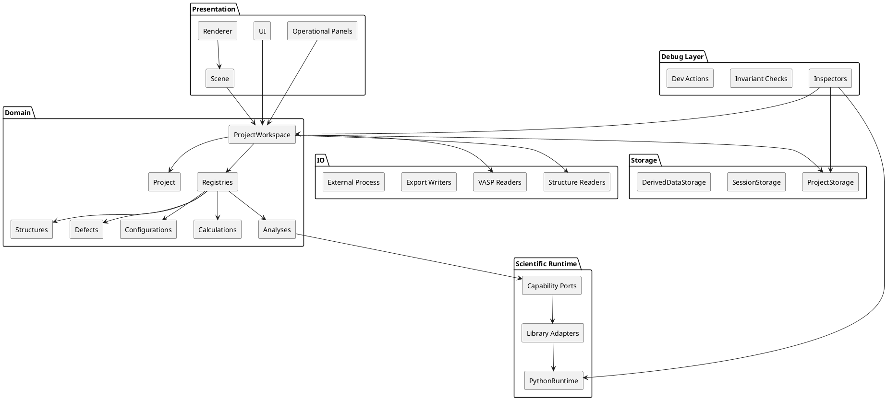

# SPEC-1-DefectsStudio-MVP

## Background

DefectsStudio is a desktop scientific workbench for the analysis of point defects in insulators and semiconductors, with particular focus on materials relevant to quantum photonics such as h-BN, diamond, SiC, and GaN.

The project exists to replace a fragmented workflow built from scattered Python scripts, manual data handling, and multiple disconnected tools with a single coherent environment for:

- crystal structure import, editing, and authoring
- volumetric visualization and figure generation
- VASP-oriented workflows and structured calculation ingestion
- defect thermodynamics
- optical and phonon analysis
- reproducible project-based scientific work

The project is developed as a solo codebase with AI assistance. As a result, the architecture prioritizes explicit ownership, strong diagnostics, documentation, testability, and predictable long-term evolution over speculative abstraction.

The implementation target for the first major release is **Scientific MVP 1.0**, covering tasks **T01–T19** from the active execution backlog. Later work is treated as post-MVP expansion.

## Requirements

### Must have

- The application must be a desktop scientific tool targeting Windows first, with Linux support designed in from the beginning.
- The architecture must support the Scientific MVP 1.0 scope: bootstrap and tooling, core runtime, Scientific Runtime, OpenGL renderer, structure editing, project system, structure authoring, volumetrics, offscreen render/export, convergence tools, VASP integration, defect thermodynamics, and optics/phonons.
- The domain model must remain the source of truth for runtime scientific and project state.
- The system must separate Presentation, Domain, Storage, IO, and Scientific Runtime concerns.
- Python must be used in MVP as a controlled scientific runtime, not as a first-class end-user scripting channel.
- ECS must be limited to scene/editor/visualization concerns and must not become the authoritative scientific model.
- The project model must support persistent project state, autosave, reopening, migration, missing-file validation, and reproducible handling of derived data.
- Heavy derived outputs must be managed separately from the lightweight core project state.
- Runtime scientific entities must include explicit support for defects, configurations, calculations, and analyses.
- The codebase must remain maintainable for solo development through documentation, tests, explicit architectural rules, and operational diagnostics.
- The application must be feature-gate-ready for future internal-only, optional, and licensed capabilities.

### Should have

- The project should remain ready for selective extraction of technical libraries or tools where strong technical isolation justifies it.
- The architecture should be ready for GPU compute backends, including CUDA-backed implementations when justified.
- The application should remain offline-first for its core workflow.
- Long-running scientific work should execute without blocking the UI.
- The implementation strategy should prefer TODO-first delivery with abstractions introduced when needed.
- Capability and dependency availability should be exposed through a central capability registry.
- The system should provide both user-facing operational diagnostics and deeper developer-only diagnostics.

### Could have

- Optional developer-oriented script runner tooling for internal workflows.
- Additional reusable module APIs once recurring patterns justify formalization.
- Transactional save semantics once the project model becomes complex enough to require them.
- Typed scientific bundle packaging tools as post-MVP technical utilities.

### Won't have in Scientific MVP 1.0

- full remote/server workflows
- defect database integration
- full symmetry/group-theory platform
- diffusion analysis
- defect template generation
- scorecard, spin, and knowledge-management extensions
- stable public user scripting as a primary interaction model
- installer-first product distribution
- the calculation packaging tool as a required part of MVP workflows

## Method

### Architectural style

DefectsStudio is designed as a **modular domain monolith** built as a single desktop executable.

`Application` acts as the **AppShell** and **composition root**. It owns startup, shutdown, runtime wiring, diagnostics bootstrap, and construction of the major services and adapters. It is not treated as another business layer in the scientific workflow.

The organizing architectural principles are:

- **Domain as source of truth**
- **ProjectWorkspace as the runtime domain container**
- **Presentation separated from scientific/domain state**
- **Storage separated from IO**
- **Python as Scientific Runtime**
- **ECS used only for scene/editor/visualization**
- **Selective ports/adapters only at meaningful external boundaries**
- **Derived data managed separately from core project state**
- **Capability-driven feature availability**
- **DebugLayer as a developer-only diagnostics layer**

### High-level system model

### Main runtime domain model

#### Identity and references

Top-level domain entities use plain **`UUID`** as both persistent and runtime identity:

- `Project`
- `Structure`
- `Defect`
- `DefectConfiguration`
- `CalculationRecord`
- `AnalysisRecord`

No extra UUID-backed handle types are required for these entities in the initial architecture.

Lower-level objects such as atoms, bonds, ECS entities, and temporary visualization objects use local or runtime-local identifiers instead.

#### Ownership and lifetime

- `Ref<>` is a wrapper around `std::shared_ptr`
- `WeakRef<>` is a wrapper around `std::weak_ptr`
- `CreateRef<>` is an accepted helper idiom
- `Ref<>` is reserved for large, shared, long-lived objects
- UI and ECS should prefer UUID-based lookup and snapshots over owning references to domain objects
- long-running jobs should prefer snapshots of inputs over holding live shared references

#### ProjectWorkspace and registries

`ProjectWorkspace` is the runtime domain container. It collects:

- `Project`
- `StructureRegistry`
- `DefectRegistry`
- `DefectConfigurationRegistry`
- `CalculationRegistry`
- `AnalysisRegistry`

`Project` itself owns:

- project identity
- metadata
- project-level settings
- focus and high-level relationships
- organizational/grouping metadata

It does **not** directly store the main object collections.

#### Scientific entities

##### `Structure`
A single concrete geometry.

##### `Defect`
A first-class scientific defect concept, not a single structure.

##### `DefectConfiguration`
A first-class domain entity representing one concrete configuration/arrangement of a defect. A defect may own many configurations.

##### `CalculationRecord`
A first-class domain entity representing one calculation with **exactly one input structure** and optional output structure. Most calculation records belong semantically to a `DefectConfiguration`, but the model must also allow project-level or structure-level calculations such as host, phase-stability, or convergence runs.

##### `AnalysisRecord`
A first-class **project-level** scientific analysis. One `AnalysisRecord` represents one coherent scientific question and may produce many outputs. Analyses may depend on:

- structures
- defects
- configurations
- calculation records
- other analyses

Analysis dependencies must remain explicit and acyclic.

### Scientific Runtime

Scientific Runtime uses:

- **capability-based public ports**
- **library-based adapters**
- normalized DTOs and explicit error models
- capability/version diagnostics
- smoke tests, contract tests, and golden/reference tests

No Python-native objects cross into domain or UI boundaries.

### Persistence contract

The persistence contract includes:

- explicit `format_version` in all persistent project files
- lightweight migration pipeline
- project-internal paths stored relative to `ProjectRoot`
- `PathResolver` as the single normalization point
- `ProjectMetadata` including project UUID and lifecycle metadata
- missing-file validation on project open
- `manual save = canonical save`
- `workspace/UI autosave = lightweight frequent state save`
- `project autosave = timed recovery/snapshot save`

### Units and precision

Canonical internal rules:

- structure positions follow the **POSCAR/VASP canonical model**
- energies use **eV**
- temperatures use **K**
- domain/scientific precision uses **double**
- renderer/GPU paths may use **float** where appropriate
- typed wrappers are preferred for selected key scientific quantities
- parser boundaries normalize units into canonical internal representation

Phonon canonical units may be finalized closer to phonon-module implementation.

### Threading and GPU compute

- UI, ImGui, OpenGL, renderer lifecycle, and final project-visible state commit are **main-thread only**
- heavy work runs in background jobs
- long-running scientific jobs use **snapshot-first** execution
- jobs do not mutate live project state directly
- cooperative cancellation is required
- no partial project commit occurs on cancel/error except for explicit dev/debug workflows
- OpenGL compute work is render-thread-only

Volumetric GPU workflows use a **request/commit model**:

- background jobs prepare immutable compute inputs
- render thread executes GPU work
- default MVP backend: OpenGL Compute Shader
- future backend option: CUDA, without changing domain ownership or analysis semantics

### Capability and diagnostics model

The system uses a central **CapabilityRegistry** covering:

- build-time capability
- runtime capability
- policy/access capability

User-facing behavior:

- unavailable capabilities appear disabled with a reason
- validation failures before execution use blocking popups
- failures during execution use notifications, logs, and task history

`DebugLayer` is a privileged diagnostics layer:

- available in Debug builds
- optionally available in internal Release builds
- excluded from Dist builds
- read-mostly by default
- production modules must not depend on it

Normal builds still include user-facing operational tooling such as:

- log panel
- job/task monitor

## Implementation

### Delivery strategy

Implementation follows a **TODO-first, abstractions-when-needed** approach.

The active TODO remains the primary execution plan. Architectural mechanisms such as a fully formalized `AnalysisRunService`, richer derived-data lifecycle management, broader module APIs, or the calculation packaging tool should be introduced when recurring problems justify them.

### Non-negotiable guardrails

From the beginning:

- clear folder and namespace boundaries
- explicit dependency rules
- documentation maintained alongside code
- tests for parsers, serialization, and Scientific Runtime boundaries
- ADRs for major architectural decisions
- avoidance of renderer/domain leakage
- avoidance of turning ECS into scientific truth
- capability checks instead of hardcoded availability assumptions
- no ad hoc Python calls outside Scientific Runtime
- no project-persistence logic mixed into raw parser/export code

### Implementation phases

#### Phase 1 — Foundation and engineering base
Covers:
- T01 Bootstrap
- T02 Documentation and Tests
- T03 Cross-Platform

Outcome:
- stable build setup
- local CI checks
- base documentation
- initial diagnostics and developer platform

#### Phase 2 — Core runtime and Scientific Runtime
Covers:
- T04 Core runtime
- T05 Python bridge / Scientific Runtime
- T06 OpenGL renderer

Outcome:
- stable application lifecycle
- operational diagnostics panels
- controlled Scientific Runtime boundary
- initial capability reporting

#### Phase 3 — Structure, scene, project, and authoring workbench
Covers:
- T07 Data Model and POSCAR/CIF Import
- T08 Atom Rendering, Scene, Selection
- T09 Advanced Renderer Architecture
- T10 Project System
- T11 Config, Settings, UX Polish
- T12 Structure Authoring Foundations
- T13 Domain Runtime Model, Identity, and Scientific Records

Outcome:
- first complete project-centric structure workflow
- ProjectWorkspace and registries become meaningful runtime containers
- persistence model becomes practical
- clipboard and drag/drop can enter early as practical UX features
- scientific records become explicit domain entities

#### Phase 4 — Volumetrics and offscreen export
Covers:
- T14 Volumetrics: CHG/PARCHG/CHGCAR
- T15 Offscreen Render Pipeline

Outcome:
- volumetric workflows
- request/commit GPU compute path
- explicit derived-data handling
- future CUDA path remains architecturally possible

#### Phase 5 — Scientific MVP completion
Covers:
- T16 Convergence
- T17 VASP Ecosystem Integration
- T18 Defect Thermodynamics Module
- T19 Optical and Phonon Properties Module

Outcome:
- complete Scientific MVP 1.0

### Build and packaging model

Default assumptions:

- one repository
- one main desktop executable
- modular monolith in code organization
- selective extraction of technical components only when justified

Post-MVP the project may add:

- portable distribution polish
- installer-based distribution
- calculation packaging / bundle tooling
- additional technical libraries where justified

## Milestones

> Detailed release tracking should also exist in the dedicated milestones document. The summary below defines the expected progression inside the SPEC.

### M1 — Foundation / Developer Platform Ready
**Release:** R0 / Internal Foundation Snapshot  
**Mapping:** T01, T02, T03, T04, T05

- [ ] Debug and Release builds work reliably
- [ ] Windows path is stable and Linux path is validated or reproducible
- [ ] Application bootstrap, event loop, and core runtime are operational
- [ ] Scientific Runtime starts correctly and passes at least one integration test
- [ ] Base documentation and local CI checks exist
- [ ] Operational diagnostics panels exist in a first practical form

### M2 — First Structure Workflow End-to-End
**Release:** R1 / Structure Editor Preview  
**Mapping:** T06, T07, T08

- [ ] POSCAR import works
- [ ] at least one additional structure format works
- [ ] structure data renders correctly in the viewport
- [ ] selection and basic structure editing work
- [ ] measurements work
- [ ] undo/redo for scene and structure editing works
- [ ] initial clipboard and drag/drop support are present in a practical scope

### M3 — Project-Centric Workbench
**Release:** R2 / Project Workbench Alpha  
**Mapping:** T09, T10, T11

- [ ] create/open/recent project works
- [ ] autosave and recovery flows work
- [ ] project state survives reopen
- [ ] tags, filters, and layout persistence work
- [ ] user-default and project-level layout/settings behavior work
- [ ] rendering and scene architecture are stable enough for future modules

### M4 — Native Structure Authoring and Scientific Records Foundation
**Release:** R3 / Structure Authoring Alpha  
**Mapping:** T12, T13

- [ ] new structure wizard works
- [ ] cell and lattice definition work
- [ ] primitive/conventional/supercell workflow works
- [ ] prototype library exists
- [ ] structures created from scratch save and reopen correctly
- [ ] ProjectWorkspace and project-scoped registries exist in practical runtime form
- [ ] DefectConfiguration is explicit in the domain model
- [ ] CalculationRecord and AnalysisRecord exist as practical runtime entities

### M5 — Volumetric Visualization & Export
**Release:** R4 / Volumetrics Preview  
**Mapping:** T14, T15

- [ ] CHG/CHGCAR/PARCHG parsing works
- [ ] scalar-field model exists
- [ ] at least one isosurface path works
- [ ] volumetric rendering controls work
- [ ] offscreen export works
- [ ] derived outputs are managed separately from core project state

### M6 — VASP Workflow Integration
**Release:** R5 / VASP Workflow Alpha  
**Mapping:** T16, T17

- [ ] convergence tooling works in a meaningful first scope
- [ ] KPOINTS workflow works
- [ ] OUTCAR metadata parsing works
- [ ] WAVECAR metadata path works
- [ ] outputs are stored in a reproducible way

### M7 — Defect Thermodynamics MVP
**Release:** R6 / Defect Thermodynamics Alpha  
**Mapping:** T18

- [ ] formation energy works for meaningful cases
- [ ] CTL, binding energy, and concentration-related outputs exist in a coherent analysis package
- [ ] results can be persisted and exported
- [ ] analysis dependencies and provenance remain explicit

### M8 — Optics & Phonons MVP Closure
**Release:** R7 / Scientific MVP 1.0  
**Mapping:** T19

- [ ] ZPL workflow exists in a practical first form
- [ ] Huang-Rhys / DWF workflow exists
- [ ] CCD workflow exists
- [ ] experimental/theoretical spectrum overlay exists
- [ ] results remain exportable, stable, and project-bound
- [ ] module boundaries remain intact

## Gathering Results

Success should be evaluated through **real scientific workflows**, not only through completion of backlog items.

After each major milestone and release, the project should be checked in four areas:

1. **Functional correctness**  
   Can a realistic end-to-end workflow be completed without falling back to ad-hoc external scripts?

2. **Scientific correctness**  
   Do results match trusted reference cases, expected datasets, or known outputs?

3. **Performance and stability**  
   Does the application remain stable under practical usage and typical data sizes?

4. **Architectural conformance**  
   Do new features still respect the intended boundaries between Domain, Presentation, Storage, IO, Scientific Runtime, and diagnostics/capability policies?

Validation should rely on reusable reference datasets and project samples that are rerun as the system evolves. Project success is also measured by whether the application reduces manual data handling, reduces script sprawl, improves reproducibility, and makes common research workflows easier to repeat.

## Need Professional Help in Developing Your Architecture?

Please contact me at [sammuti.com](https://sammuti.com) :)
