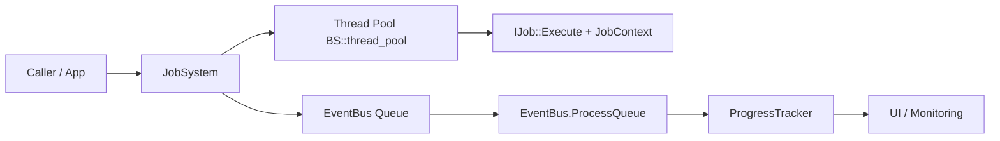
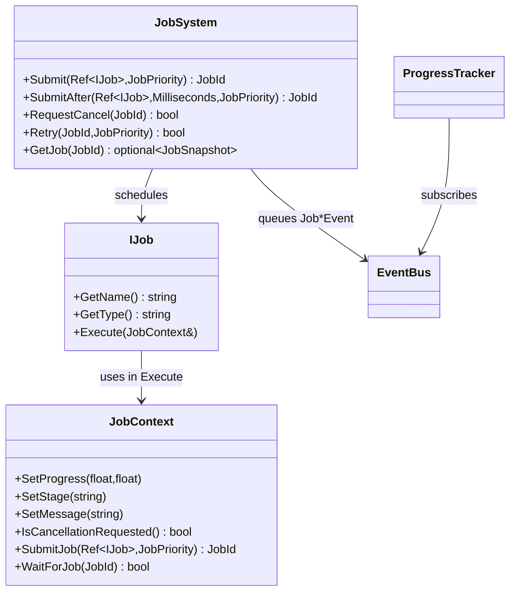
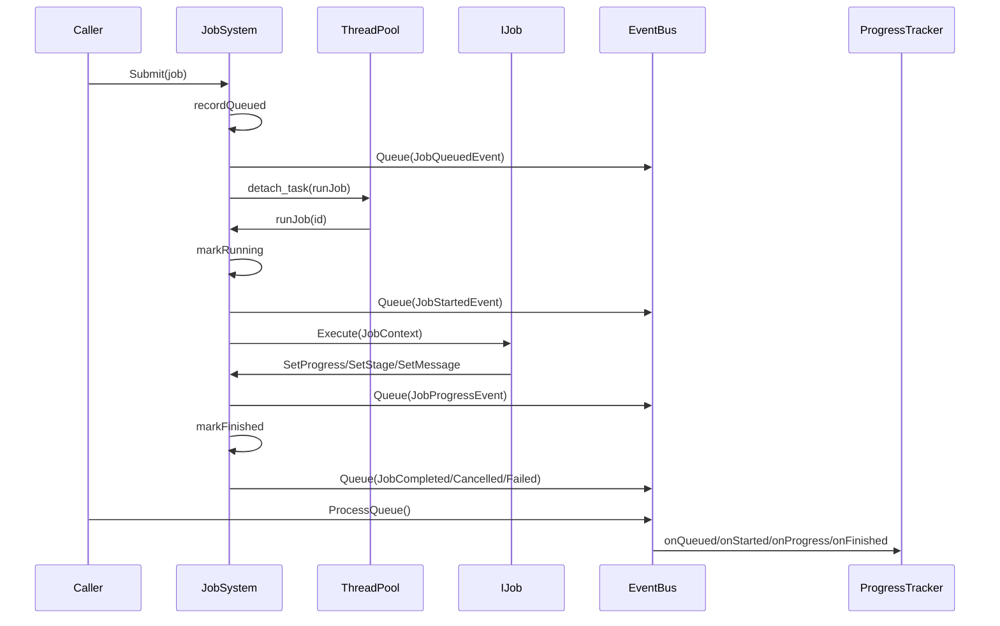

# JobSystem + ProgressTrackingSystem: dokumentacja praktyczna

Ten dokument ma 3 poziomy szczegolowosci:
1. Wprowadzenie do systemu (high-level overview).
2. Dokumentacja dla uzytkownika (API + usage guide).
3. Dokumentacja dla developerow (deep dive).

## Zrodlo prawdy

Opis w tym dokumencie wynika bezposrednio z kodu i testow:
- src/Core/JobSystem/JobSystem.hpp
- src/Core/JobSystem/JobSystem.cpp
- src/Core/JobSystem/JobContext.hpp
- src/Core/JobSystem/JobSystemTypes.hpp
- src/Core/ProgressTrackingSystem/ProgressTracker.hpp
- src/Core/ProgressTrackingSystem/ProgressTracker.cpp
- src/Core/EventSystem/BusEventSystem/EventBus.hpp
- src/Core/EventSystem/BusEventSystem/EventBus.cpp
- src/App/Events/JobEvents.hpp
- tests/Core/JobSystem/*.cpp
- tests/Core/ProgressTracking/ProgressTrackerTests.cpp

---

## 1) Wprowadzenie do systemu (high-level overview)

### Jaki problem rozwiazuja te systemy

JobSystem rozwiazuje problem uruchamiania i nadzorowania pracy asynchronicznej:
- przyjmuje zadania,
- wykonuje je rownolegle,
- pozwala sterowac cyklem zycia (cancel, resume, retry),
- przechowuje stan i logi.

ProgressTrackingSystem (ProgressTracker) rozwiazuje problem obserwowalnosci:
- slucha eventow lifecycle jobow,
- buduje lekki read-model dla UI,
- pozwala szybko pobierac aktywne i zakonczone wpisy postepu.

### Ogolna architektura



### Glowne komponenty i role

- JobSystem
  - orchestruje lifecycle joba,
  - przechowuje JobRecord i JobSnapshot,
  - zarzadza delayed schedulerem i zmiana liczby workerow.
- IJob
  - kontrakt domenowy zadania (GetName, GetType, Execute).
- JobContext
  - API runtime dla kodu zadania: progress, stage, message, logi, cancel, nested jobs.
- EventBus
  - kolejkuje i dostarcza eventy.
- ProgressTracker
  - materializuje eventy do wpisow ProgressEntrySnapshot.

### Przeplyw pracy: od submit do finish

1. Caller wywoluje Submit lub SubmitAfter.
2. JobSystem tworzy wpis Queued i publikuje JobQueuedEvent.
3. Zadanie trafia od razu do puli albo do kolejki opoznionej.
4. Worker uruchamia runJob.
5. runJob aktualizuje Running i publikuje JobStartedEvent.
6. Kod IJob::Execute raportuje postep przez JobContext.
7. JobSystem publikuje JobProgressEvent przy zmianie progress/stage/message.
8. Po zakonczeniu JobSystem ustawia finalny status i publikuje event koncowy.
9. ProgressTracker odbiera eventy i aktualizuje read-model.

### Jak oba systemy wspolpracuja

- JobSystem jest producentem eventow lifecycle.
- ProgressTracker jest konsumentem eventow lifecycle.
- EventBus jest granica miedzy runtime wykonania a warstwa obserwacji.

### Krotki scenariusz narracyjny

Uzytkownik uruchamia import danych. Aplikacja submituje ImportJob do JobSystem. Job startuje na workerze, regularnie raportuje postep i etap. JobSystem emituje eventy do EventBus. W glownej petli aplikacji EventBus.ProcessQueue przekazuje eventy do ProgressTracker. UI pobiera aktywne snapshoty i pokazuje pasek postepu. Po sukcesie status przechodzi na Completed.

---

## 2) Dokumentacja dla uzytkownika (API + usage guide)

Ta sekcja zaklada, ze chcesz systemu uzywac, a nie modyfikowac internals.

### Mentalny model (intuicyjny)

- JobSystem to kuchnia.
- IJob to przepis.
- Worker threads to kucharze.
- JobContext to panel, przez ktory kucharz raportuje postep i pyta o cancel.
- EventBus to tablica ogloszen.
- ProgressTracker to recepcja, ktora robi czytelny status dla UI.

### Publiczne API: JobSystem

Plik: src/Core/JobSystem/JobSystem.hpp

Konstrukcja i lifecycle:
- JobSystem(WeakRef<EventBus> eventBus = {}, size_t threadCount = 0)
- ~JobSystem()
- void Shutdown()

Submit:
- JobId Submit(const Ref<IJob>& job, JobPriority priority = Normal)
- JobId SubmitAfter(const Ref<IJob>& job, Time::Milliseconds delay, JobPriority priority = Normal)

Sterowanie:
- bool RequestCancel(JobId id)
- bool Resume(JobId id)
- bool Reset(JobId id)
- bool Retry(JobId id, JobPriority priority = Normal)
- bool RemoveFromHistory(JobId id)

Konfiguracja runtime:
- size_t GetThreadCount() const
- bool SetThreadCount(size_t threadCount)

Zapytania:
- optional<JobSnapshot> GetJob(JobId id) const
- vector<JobSnapshot> GetAllJobs() const
- vector<JobSnapshot> GetActiveJobs() const
- vector<JobSnapshot> GetFinishedJobs() const
- vector<JobLogEntry> GetLogs(JobId id) const

### Publiczne API: JobContext

Plik: src/Core/JobSystem/JobContext.hpp

Postep i komunikacja:
- SetProgress(completedWork, totalWork)
- SetStage(stage)
- SetMessage(message)

Logowanie:
- LogDebug
- LogInfo
- LogWarning
- LogError

Cancel:
- IsCancellationRequested()
- ThrowIfCancellationRequested()

Nested jobs:
- SubmitJob(child, priority)
- WaitForJob(jobId)
- SubmitJobSequential(child, priority)

### Publiczne API: ProgressTracker

Plik: src/Core/ProgressTrackingSystem/ProgressTracker.hpp

Powiazanie z event bus:
- BindEventBus(WeakRef<EventBus>)
- UnbindEventBus()

Odczyt stanu:
- optional<ProgressEntrySnapshot> GetSnapshot(JobId)
- vector<ProgressEntrySnapshot> GetAllSnapshots()
- vector<ProgressEntrySnapshot> GetActiveSnapshots()
- vector<ProgressEntrySnapshot> GetFinishedSnapshots()
- bool RemoveEntry(JobId)

### Odpowiedzialnosc kluczowych klas

- IJob
  - tylko logika zadania.
- JobSystem
  - scheduling, lifecycle, kontrola, przechowywanie snapshotow i logow.
- JobContext
  - kontrolowany kanal komunikacji joba z runtime.
- EventBus
  - dostarczanie eventow i kolejka eventow.
- ProgressTracker
  - read-model postepu dla UI.

### UML: relacje klas (uzytkownik)



### Lifecycle joba (krok po kroku)

1. Job zostaje zarejestrowany jako Queued.
2. Job trafia do puli lub czeka w kolejce opoznionej.
3. Status zmienia sie na Running.
4. Job raportuje postep przez JobContext.
5. Job konczy sie jako Completed, Cancelled albo Failed.
6. Snapshot i logi sa zapisane w JobSystem.
7. Eventy odswiezaja ProgressTracker.

### Jak tworzyc pojedyncze joby

```cpp
#include "Core/JobSystem/JobSystem.hpp"
#include "Core/JobSystem/JobContext.hpp"

class ImportJob final : public DefectStudio::IJob {
public:
    std::string GetName() const override { return "ImportJob"; }
    std::string GetType() const override { return "IO"; }

    void Execute(DefectStudio::JobContext& context) override {
        context.SetStage("prepare");
        context.SetProgress(0.0f, 3.0f);

        for (int step = 1; step <= 3; ++step) {
            context.ThrowIfCancellationRequested();
            // ... praca ...
            context.SetProgress(static_cast<float>(step), 3.0f);
        }

        context.SetStage("done");
        context.SetMessage("Import zakonczony");
    }
};

void RunSingleJob(DefectStudio::Ref<DefectStudio::EventBus> bus) {
    DefectStudio::JobSystem jobSystem(DefectStudio::CreateWeakRef(bus));
    const DefectStudio::JobId id = jobSystem.Submit(DefectStudio::CreateRef<ImportJob>());
    (void)id;
}
```

### Jak tworzyc joby wieloetapowe / zlozone (nested)

```cpp
class ChildJob final : public DefectStudio::IJob {
public:
    std::string GetName() const override { return "ChildJob"; }
    std::string GetType() const override { return "Pipeline"; }
    void Execute(DefectStudio::JobContext& context) override {
        context.SetStage("child-work");
        context.SetProgress(1.0f, 1.0f);
    }
};

class ParentJob final : public DefectStudio::IJob {
public:
    std::string GetName() const override { return "ParentJob"; }
    std::string GetType() const override { return "Pipeline"; }

    void Execute(DefectStudio::JobContext& context) override {
        context.SetStage("submit-child");
        auto childId = context.SubmitJobSequential(DefectStudio::CreateRef<ChildJob>());
        if (childId == 0) {
            context.LogWarning("Child nie zostal wykonany sekwencyjnie");
        }
        context.SetStage("parent-done");
        context.SetProgress(1.0f, 1.0f);
    }
};
```

### Jak raportowac progres

Najwazniejsze:
- SetProgress aktualizuje liczby.
- SetStage i SetMessage aktualizuja kontekst.
- Kazde z tych wywolan powoduje emisje JobProgressEvent przez JobSystem.

Praktyka:
- Uzywaj stalej skali totalWork.
- Raportuj po zakonczonych krokach, nie co iteracje mikro-petli.

### Jak subskrybowac zdarzenia

```cpp
auto bus = DefectStudio::CreateRef<DefectStudio::EventBus>();

auto onQueued = bus->Subscribe<DefectStudio::JobQueuedEvent>(
    [](const DefectStudio::JobQueuedEvent& e) {
        // np. telemetry / UI marker
        (void)e;
    }
);

auto onFinished = bus->Subscribe<DefectStudio::JobCompletedEvent>(
    [](const DefectStudio::JobCompletedEvent& e) {
        // np. finalny status w UI
        (void)e;
    }
);

// W glownej petli aplikacji:
// bus->ProcessQueue();
```

### Jak rozszerzac system o wlasne joby

1. Dziedzicz po IJob.
2. Trzymaj logike biznesowa w Execute.
3. Regularnie sprawdzaj cancel.
4. Raportuj stage/progress tak, aby UI nie zgadywalo.
5. Nie odwoluj sie bezposrednio do internals JobSystem.

### Dobre praktyki

- Traktuj Execute jako kod, ktory moze byc anulowany w dowolnym momencie.
- Uzywaj SubmitAfter dla realnych opoznien biznesowych, nie jako hack do synchronizacji.
- Przechowuj identyfikatory JobId po stronie wywolujacego.
- Dla zadan zagniezdzonych preferuj SubmitJobSequential tam, gdzie parent musi czekac na child.

### Czego nie robic (typowe bledy)

- Nie zakladaj, ze RequestCancel natychmiast przerwie kod (to cancel kooperacyjny).
- Nie wywoluj Shutdown z kodu joba.
- Nie blokuj workerow dlugim busy wait bez potrzeby.
- Nie zapominaj o ProcessQueue w petli aplikacji, bo tracker nie bedzie aktualny.

### FAQ / typowe bledy

P: Czemu tracker nie pokazuje postepu mimo ze job dziala?
O: Najczesciej nie jest wywolywane EventBus.ProcessQueue.

P: Czemu SubmitJobSequential czasem zwraca 0?
O: W trybie pojedynczego workera cooperative wait celowo fail-fast, aby uniknac deadlocka.

P: Czemu RequestCancel nie konczy od razu?
O: Job musi sam dojsc do punktu sprawdzania cancel.

### Cheat sheet API (sekcja 2)

- Start: JobSystem(eventBus, threadCount)
- Natychmiast: Submit(job, priority)
- Opoznione: SubmitAfter(job, delay, priority)
- Cancel: RequestCancel(id)
- Wznowienie: Resume(id)
- Ponowka: Retry(id)
- Reset stanu: Reset(id)
- Odczyt: GetJob / GetActiveJobs / GetFinishedJobs / GetLogs
- Nested: JobContext.SubmitJob / WaitForJob / SubmitJobSequential
- Tracker: ProgressTracker.GetAllSnapshots / GetActiveSnapshots

---

## 3) Dokumentacja dla developerow (deep dive)

Ta sekcja jest dla osob, ktore zmieniaja implementacje.

### Wnetrzne API i klasy krytyczne

- JobSystem
  - submitInternal: wspolna brama submitu (immediate i delayed).
  - runJob: lifecycle wykonania i mapowanie callbackow JobContext.
  - waitForJobCooperative: ochrona anty-deadlock dla nested waits.
  - delayedWorkerLoop: scheduler opoznionych zadan.
  - threadCountWorkerLoop: asynchroniczna rekonfiguracja liczby workerow.
- ProgressTracker
  - onQueued/onStarted/onProgress/onCompleted/onCancelled/onFailed.
- EventBus
  - dispatchByType, ProcessQueue, unsubscribeById.

### Co jest synchroniczne, a co asynchroniczne

Synchroniczne (w watku caller):
- Submit/SubmitAfter do momentu rejestracji rekordu i queue eventu.
- RequestCancel/Reset/Retry/Resume (mutacja stanu i logow).
- Get* API (snapshot/log retrieval).

Asynchroniczne:
- faktyczne Execute joba (thread pool),
- delayed scheduler (osobny jthread),
- thread-count worker (osobny jthread),
- dostarczanie queued eventow dopiero przy EventBus.ProcessQueue.

### Synchronizacja: gdzie i jak

JobSystem:
- m_RecordsMutex chroni m_Records i snapshot/log mutacje.
- m_DelayedMutex + m_DelayedCv chroni i sygnalizuje m_DelayedSubmissions.
- m_ThreadCountMutex + m_ThreadCountCv chroni m_PendingThreadCount.
- m_ShutdownRequested i m_NextId sa atomikami.

ProgressTracker:
- m_Mutex chroni m_Entries we wszystkich handlerach i getterach.

EventBus:
- m_QueueMutex chroni kolejke queued eventow.
- listener lists nie maja osobnego mutexa; modyfikacje w trakcie dispatch sa deferowane przez pendingAdditions/pendingRemoval.

### Jak dziala harmonogramowanie jobow

Immediate:
- enqueueForExecution -> m_Pool.detach_task(runJob, priority).

Delayed:
- submitInternal zapisuje DelayedSubmission z dueAt.
- delayedWorkerLoop:
  - czeka az cos jest w kolejce,
  - wybiera najblizsze dueAt (min_element),
  - jesli termin jeszcze nie nadszedl, wait_until,
  - po dueAt przekazuje job do enqueueForExecution.

### Diagram kolejki/schedulera (delayed)

```mermaid
flowchart TD
  A[SubmitAfter] --> B[recordQueued + Queue JobQueuedEvent]
  B --> C[push DelayedSubmission(dueAt)]
  C --> D[notify delayed CV]
  D --> E[delayedWorkerLoop wake]
  E --> F{dueAt <= now?}
  F -- no --> G[wait_until(next dueAt)]
  F -- yes --> H[pop ready submission]
  H --> I[enqueueForExecution]
  I --> J[runJob on thread pool]
```

### Jak dziala system eventow

- JobSystem publikuje Queue(Job*Event), nie Publish bezposrednio.
- EventBus.ProcessQueue zdejmuje snapshot kolejki pod m_QueueMutex, potem dispatchuje bez locka kolejki.
- Subskrypcje dodane w trakcie dispatch sa odkladane do pendingAdditions.
- Unsubscribe w trakcie dispatch oznacza pendingRemoval + skipThisDispatch.

### Jak raportowany i agregowany jest progres

Raportowanie:
- JobContext.SetProgress/SetStage/SetMessage -> callbacki -> update* w JobSystem.
- update* zapisuje snapshot i publikuje JobProgressEvent.

Agregacja:
- ProgressTracker odbiera JobProgressEvent i aktualizuje completedWork, totalWork, stage, message.
- Przy Completed tracker domyka completedWork do totalWork, jezeli trzeba.

### Sequence diagram: lifecycle joba



### Potencjalne race conditions i obecne zabezpieczenia

1. Rownolegle submity i odczyty rekordow
- Ryzyko: uszkodzenie m_Records.
- Zabezpieczenie: m_RecordsMutex + atomiki dla prostych flag/ID.

2. Modyfikacja subskrypcji EventBus podczas dispatch
- Ryzyko: iterator invalidation i niestabilna kolejnosc callbackow.
- Zabezpieczenie: pendingAdditions i pendingRemoval + cleanup po dispatch.

3. Nested wait przy 1 workerze
- Ryzyko: deadlock parent-child.
- Zabezpieczenie: waitForJobCooperative fail-fast gdy system wykrywa single-worker parent wait.

4. Testowy race na wspolnym vectorze executionOrder
- Ryzyko: flaky test w nested submission.
- Zabezpieczenie: mutex w helperach testowych (naprawione w testach).

### Założenia projektowe i trade-offs

- EventBus ma model queued i jawne ProcessQueue.
  - Plus: kontrola punktu dostarczania eventow.
  - Minus: latwo zapomniec o ProcessQueue.

- Cancel jest kooperacyjny.
  - Plus: bezpieczniejszy dla zasobow.
  - Minus: brak gwarancji natychmiastowego stop.

- waitForJobCooperative uzywa polling + sleep(1 ms).
  - Plus: prostota.
  - Minus: niepotrzebne wake-upy i slabiej skalowalne oczekiwanie.

### Miejsca krytyczne i latwe do zepsucia

- JobSystem::runJob
  - centralny punkt lifecycle i mapowania callbackow.
- JobSystem::submitInternal
  - granica poprawnosci submitu delayed/immediate.
- JobSystem::delayedWorkerLoop
  - logika dueAt i budzenia CV.
- EventBus::dispatchByType
  - semantyka stopPropagation i odroczonych zmian listenerow.
- ProgressTracker::onProgress
  - mapowanie event->read model (status/progress/stage/message).

### Thread safety (jawnie)

Bezpieczne wielowatkowo:
- JobSystem submit/control/gettery (wewnetrznie synchronizowane).
- ProgressTracker gettery i handlery (m_Mutex).
- EventBus.Queue i EventBus.ProcessQueue od strony kolejki (m_QueueMutex).

Wymaga ostroznosci:
- Kod w IJob::Execute to kod uzytkownika, runtime go nie synchronizuje.
- EventBus listener lifecycle i dispatch nie sa zaprojektowane jako lock-free API dla dowolnych wzorcow modyfikacji z wielu watkow naraz.

### Propozycje ulepszen API/architektury

1. Zastapic polling w waitForJobCooperative mechanizmem condition_variable per job.
2. Dodac dedykowany status dla fail-fast nested wait, zamiast zwracania 0 z SubmitJobSequential bez kontekstu.
3. Rozwazyc batching/coalescing JobProgressEvent dla bardzo chatty jobow.
4. Dodac metryke czasu w statusie (queued duration, running duration) bez liczenia po stronie UI.
5. Rozszerzyc EventBus o jasny kontrakt thread-safety w komentarzu API.

### Potencjalne miejsca refaktoryzacji

- Standaryzacja semantyki Retry/Reset/Resume (czesciowo podobne bloki resetowania snapshotu).
- Wydzielenie policy dla publikacji progress eventow (obecnie 3 sciezki update -> Queue progress).
- Lepsza struktura dokumentacji test helpers, bo aktualnie sa faktycznym speciem dla nested behavior.

---

## Podsumowanie praktyczne

- Dla uzytkownika: implementuj IJob, raportuj postep, przetwarzaj EventBus queue.
- Dla maintainera: pilnuj granic synchronizacji i nie psuj runJob/dispatchByType.
- Dla UI: ProgressTracker jest read-modelem i powinien byc jedynym zrodlem statusu ekranu monitoringu.
