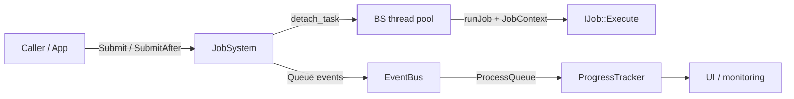
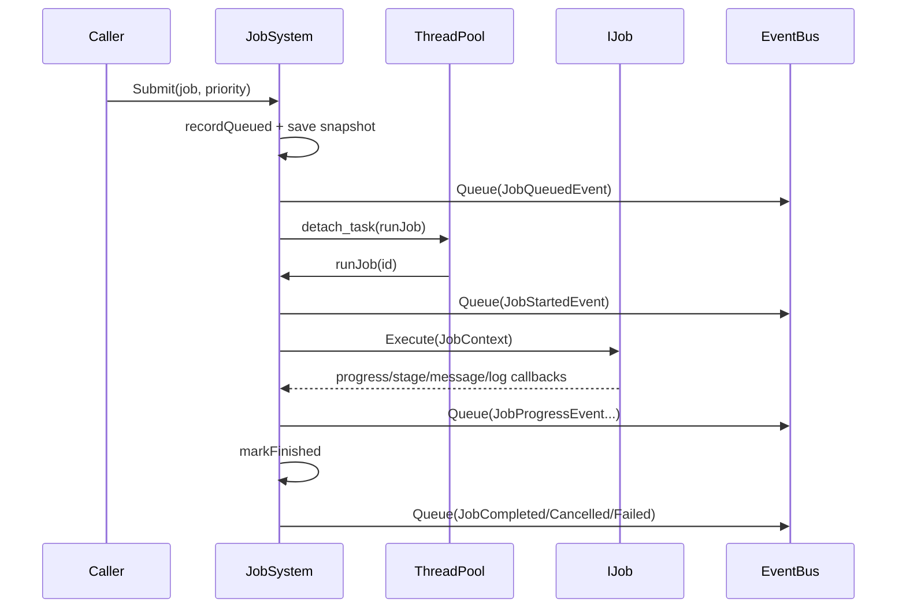
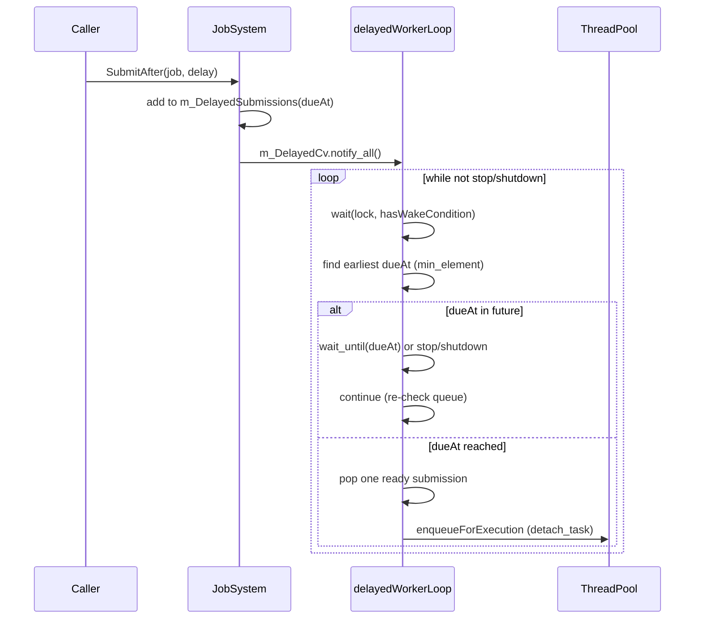
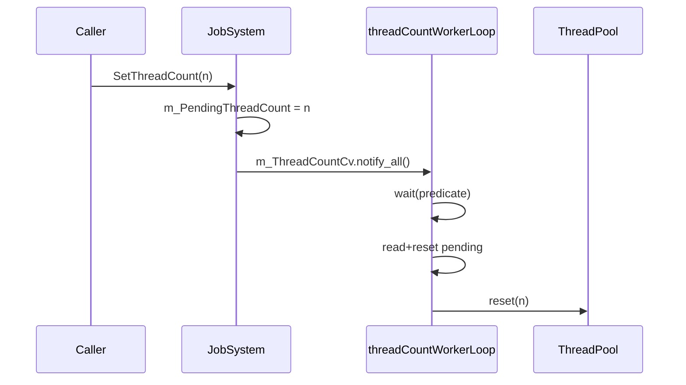
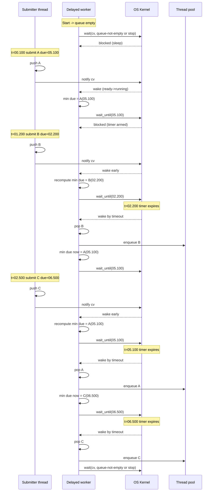

# Job System Primer (od zera)

Ten dokument jest dla pierwszego kontaktu z systemem.
Cel: wiedziec co wywolac, co dzieje sie synchronicznie, co asynchronicznie i kto za co odpowiada.

## 1. Szybki obraz systemu

- `JobSystem` przyjmuje zgloszenia zadan i zarzadza ich cyklem zycia.
- `BS::thread_pool` wykonuje zadania robocze (asynchronicznie).
- `JobContext` to API dostepne wewnatrz `IJob::Execute(...)`.
- `EventBus` dostaje eventy lifecycle (`Queued`, `Started`, `Progress`, `Completed/Cancelled/Failed`).
- `ProgressTracker` buduje read model dla UI na podstawie eventow.

## 2. Odpowiedzialnosci klas

### JobSystem

- Publiczne API submit/control/query/shutdown.
- Trzyma `m_Records` (snapshot + logi + statusy).
- Ma 2 watki serwisowe:
  - `m_ThreadCountWorker` (zmiana liczby workerow),
  - `m_DelayedWorker` (dispatch opoznionych zadan).
- Pilnuje synchronizacji przez osobne mutexy (`m_RecordsMutex`, `m_ThreadCountMutex`, `m_DelayedMutex`).

### IJob

- Kontrakt domenowy pracy: `Execute(JobContext&)`.
- Job sam odpowiada za kooperacyjne sprawdzanie cancel.

### JobContext

- API dla kodu joba: progress, stage, message, logi, cancel query.
- Umozliwia nested submission (`SubmitJob`) i oczekiwanie (`WaitForJob`).

### EventBus + ProgressTracker

- `JobSystem` publikuje eventy.
- `ProgressTracker` robi projekcje do formatu czytelnego dla UI.

## 3. Publiczne API JobSystem: co wywolujesz i po co

### Start i stop

- Konstruktor `JobSystem(...)`: tworzy pule i uruchamia watki serwisowe.
- `Shutdown()`: zatrzymuje przyjmowanie nowej pracy i domyka watki.

### Submission

- `Submit(job, priority)`
  - Uzyj, gdy zadanie ma startowac od razu.
- `SubmitAfter(job, delay, priority)`
  - Uzyj, gdy zadanie ma ruszyc po czasie.

### Kontrola

- `RequestCancel(id)`
  - Ustawia flage cancel; wykonanie zatrzymuje sie kooperacyjnie (to nie jest kill thread).
- `Resume(id)`
  - Dla `Cancelled`: czyści cancel i ponownie kolejkuje job.
- `Retry(id, priority)`
  - Dla zakonczonych: reset runtime state i ponowne uruchomienie.
- `Reset(id)`
  - Dla zakonczonych: reset stanu do `Queued` bez natychmiastowego startu.
- `RemoveFromHistory(id)`
  - Usuwa tylko zakonczone wpisy z historii.

### Konfiguracja runtime

- `GetThreadCount()`
- `SetThreadCount(n)`
  - Prosba o zmiane jest asynchroniczna, realizowana przez worker serwisowy.

### Odczyt

- `GetJob(id)`, `GetAllJobs()`, `GetActiveJobs()`, `GetFinishedJobs()`, `GetLogs(id)`

## 4. Co jest synchroniczne, a co asynchroniczne

### Synchroniczne (w watku wywolujacym)

- Wejscie do `Submit`/`SubmitAfter` i walidacja argumentow.
- Utworzenie wpisu w `m_Records` (`recordQueued`).
- Publikacja eventu `Queued` do EventBus queue.
- Dodanie wpisu do `m_DelayedSubmissions` (dla delayed).
- Zgloszenie prosby o resize przy `SetThreadCount` (ustawienie pending + notify).

### Asynchroniczne

- Faktyczne wykonanie joba (`runJob` w worker pool).
- Zmiana liczby workerow (`threadCountWorkerLoop`).
- Dispatch delayed zadan (`delayedWorkerLoop`).
- Przetwarzanie event queue przez EventBus (w swoim cyklu aplikacji).

## 5. Przeplyw: natychmiastowe Submit

## 6. Przeplyw: SubmitAfter (delayed)

## 7. Przeplyw: SetThreadCount

## 8. Twoje pytanie o while i "usypianie"

Tak, dobrze to lapiesz, ale z jedna wazna korekta:

- Petla `while (true)` istnieje caly czas na osobnym watku serwisowym.
- To nie warunek z poczatku petli (np. szybki `if stop/shutdown`) jest glownym mechanizmem oszczedzania CPU.
- Glowny mechanizm to `condition_variable::wait(...)` / `wait_until(...)`:
  - watkowi oddawany jest CPU,
  - scheduler go nie wykonuje, dopoki nie bedzie sygnalu albo czasu,
  - po wybudzeniu predykat jest sprawdzany ponownie.

Czyli: petla jest "zawsze", ale aktywna praca tylko punktowo.

## 9. Kiedy wolac co (cheat sheet)

- Chce od razu: `Submit`.
- Chce pozniej: `SubmitAfter`.
- Chce poprosic o zatrzymanie: `RequestCancel`.
- Chce wznowic anulowane: `Resume`.
- Chce uruchomic ponownie zakonczone: `Retry`.
- Chce tylko odswiezyc stan do queued: `Reset`.
- Chce wyczyscic historie: `RemoveFromHistory`.
- Chce zmienic rownoleglosc: `SetThreadCount`.

## 10. Co sprawdzic, gdy cos nie dziala

- Czy job kooperacyjnie sprawdza cancel w `Execute`.
- Czy event queue jest regularnie procesowana.
- Czy nie ma stalego locka na records/delayed/threadcount.
- Czy `Shutdown()` zostal wykonany i watki sie domknely.

## 10a. Zasada dla nested jobs (anty-deadlock)

Jesli job uruchamia child jobi i chce na nie czekac, nalezy korzystac z callbacka kooperacyjnego (`waitForJobCooperative`) przez API `JobContext`:

- `JobContext::WaitForJob(childId)`
- albo `JobContext::SubmitJobSequential(...)` (submit + wait)

Nie nalezy implementowac wlasnego blokujacego czekania poza tym mechanizmem.
Powod: przy malej liczbie workerow (szczegolnie 1) parent moze zablokowac worker i child nigdy nie dostanie czasu CPU.

Wymagane testy:

- Scenariusz deadlock-risk: parent submituje child i czeka przy `threadCount=1`.
- Scenariusz recovery-path: mechanizm ochronny zwraca sterowanie (brak zawieszenia procesu testowego).
- Scenariusz normalny: `threadCount>=2`, parent czeka i child konczy sie poprawnie.

Miejsce ochrony: `waitForJobCooperative` w `JobSystem`.

## 10b. JobContext i callbacki - kiedy uzywac ktorego

`JobContext` jest adapterem miedzy kodem domenowym `IJob::Execute(...)` a runtime `JobSystem`.

Callbacki przekazywane przez `runJob`:

- progress callback
  - Co robi: aktualizuje `completedWork/totalWork`.
  - Kiedy uzywac: po krokach pracy, gdy chcesz pokazywac postep.
- stage callback
  - Co robi: ustawia aktualny etap (`currentStage`).
  - Kiedy uzywac: przy przejsciu miedzy fazami algorytmu.
- message callback
  - Co robi: ustawia biezacy komunikat (`currentMessage`).
  - Kiedy uzywac: dla krotkiego statusu przydatnego w UI.
- log callback
  - Co robi: dopisuje wpis do logow joba.
  - Kiedy uzywac: dla diagnostyki i breadcrumbow wykonania.
- cancel query callback
  - Co robi: odczytuje flage anulowania.
  - Kiedy uzywac: regularnie w dluzszych petlach i przed kosztownymi krokami.
- submit child callback
  - Co robi: submituje child job z `parentId`.
  - Kiedy uzywac: przy podziale pracy na podzadania.
- wait child callback (`waitForJobCooperative`)
  - Co robi: kooperacyjne oczekiwanie na child job, z ochrona anty-deadlock.
  - Kiedy uzywac: zawsze gdy parent czeka na child.

## 11. Co zostalo zweryfikowane w macierzy

- `clang` `Release` i `Dist` przechodza pelny test matrix.
- `JobSystemNestedSubmissionTests.MultipleJobsCanSubmitOtherJobsConcurrently` przestal flakowac po dodaniu synchronizacji do wspolnego `executionOrder` w helperach testowych.
- Ostrzezenia kompilatora w `ConfigManager.cpp`, `EditorLayer.cpp`, `TaskMonitorWindow.hpp` i testach porownujacych typy nadal sie pojawiaja, ale nie blokuja uruchomienia.

Regula praktyczna dla autorow `IJob`:

- do raportowania stanu: `SetProgress`, `SetStage`, `SetMessage`, `Log*`
- do anulowania: `ThrowIfCancellationRequested` i okresowe `IsCancellationRequested`
- do nested execution: `SubmitJob` + `WaitForJob` (lub `SubmitJobSequential`)

## 12. Diagram czasowy: 3 delayed zadania (szczegolowy)

Ponizszy diagram pokazuje scenariusz z trzema zadaniami zgloszonymi w roznych chwilach i z roznymi delay.
Cel: zobaczyc kiedy worker zasypia, kiedy budzi sie przez notify, a kiedy budzi sie przez timeout `wait_until`.

