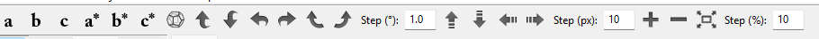

> Aktywne blokery, pytania bez odpowiedzi i nierozstrzygnięte decyzje.  
> Rozwiązane problemy przenoś do sekcji **Resolved** na dole pliku.  
> Znane ograniczenia bez aktywnego priorytetu → `KNOWN_ISSUES.md`

---

### Aktywne problemy
1. Brak możliwości przełączenia na drugi typ kamery: 
2. MW (mouse wheel) powinno być do obracania się a przytrzumane z shift przesuwać kamerę, nie superkomórkę
3. obrót powinien być wedle lokalnych osi kamery, a nie zdefiniowanych globalnie. Ma być tak jak w VESTA 
4.  skopiuj też ten pasek. (dodam odpowiednie ikony w assets)
5. dodam zdjęcie ale wiązania wchodzą w atomy i brzydko to wygląda
6. oświetlenie jest tylko z jednej strony. Tutaj powinno być równomierne z każdej
7. dodaj mechanizm mouse-picking (z mechanizmem ctrl jako dodawania wielu atomów) i podświetlenie atomu który jest wybrany
8. Funkcję createSphereMesh, createCylinderMesh powinny być zastąpione przez funkcję ładującą mesh z asset (asset też trzeba wytworzyć (kolejne zadanie))
9. ilość atomów jest ograniczona (zaraz dodam listę wszystkich atomów)
---

### Resolved

1. Wyjaśnienie mechaniki `threadCountWorkerLoop` / `m_PendingThreadCount` / `m_ThreadCountCv` omówione w rozmowie (bez rozbudowanego opisu w tym pliku).
2. `clang` build/test matrix dla `Release` i `Dist` zostal potwierdzony jako zielony po poprawkach czyszczenia artefaktow i konfiguracji linkowania.
3. Rzadki race w `JobSystemNestedSubmissionTests.MultipleJobsCanSubmitOtherJobsConcurrently` zostal usuniety przez synchronizacje zapisu do wspolnej kolejki wykonywania w testach.

---